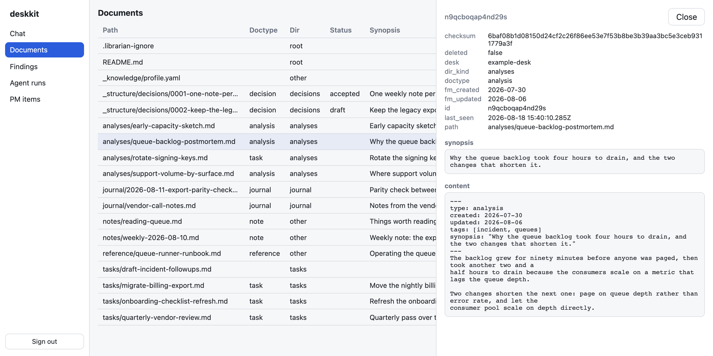
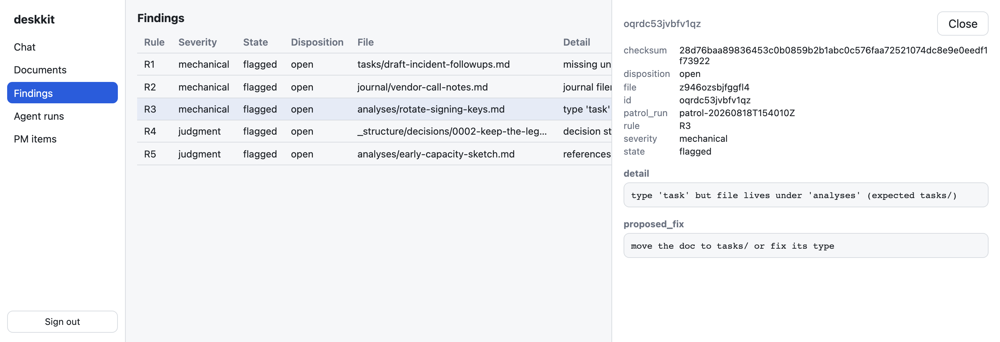
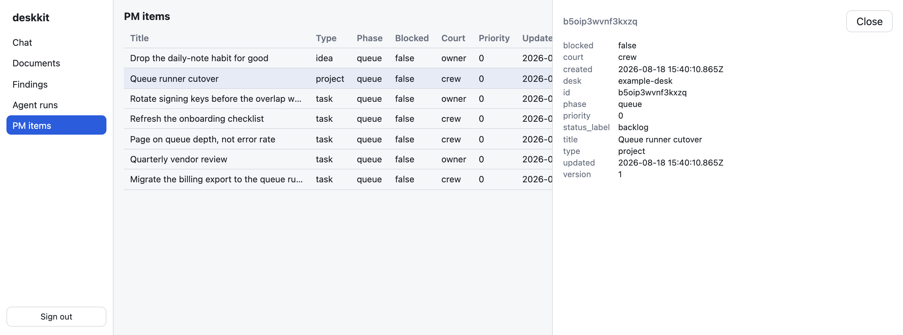

# deskkit

**Point it at the folder where your notes, decisions, and status live. It indexes the tree, flags
every convention violation, and repairs the mechanical ones — with an undo you can trust.**

## Why this exists

A planning folder rots quietly. Frontmatter goes missing, a task ends up filed under `analyses/`,
a journal entry gets a name nothing can sort. Each fix is mechanical and nobody makes them,
because by hand it is tedious and by script it is frightening — a bulk rewrite across your own
notes has no undo.

deskkit makes those fixes and keeps the undo. It records a file's original bytes *before* it
writes anything, so every applied fix reverses byte-exact with one command. Read-only by default:
indexing and flagging never touch your files, and the one command that does is supervised — you
run it by hand, and an agent only gets it behind an environment flag that is off by default.

## What you get today

- **A conformance report you didn't have to write.** `sweep` indexes the tree, `patrol` flags
  violations of six shared rules. Both are read-only and neither needs an API key.
- **Mechanical repairs behind a two-step gate.** `propose-fix` plans the change and records the
  original; `apply-fix` writes it; `restore` puts the exact bytes back. Judgment calls are flagged
  for you, never auto-applied.
- **A work graph that can't skip its paperwork.** Items move `queue → work → review → terminal`,
  and a phase advance is refused until the document that phase requires validates.
- **Four doors, one core.** A CLI, an MCP server for agent sessions, a terminal TUI, and a browser
  UI — all served from the same single binary, with an embedded database. No services to run.
- **Nothing you install carries your name.** You personalize a desk once, in its
  `_knowledge/profile.yaml`; no shipped skill, template, or tool is ever edited.

## What it looks like

`deskkit serve` puts the whole store behind a browser UI at `http://127.0.0.1:8090/`. Below is a
scratch desk of eighteen files, swept and patrolled.

**Documents** — the indexed tree, with the parsed frontmatter and content of whatever you select:



**Findings** — one row per rule violation, each with the detail and the fix that would be applied.
`R1`–`R3` are mechanical and repairable; `R4`–`R6` are judgment calls left for you:



**PM items** — the work graph, with each item's phase, court, and blocked state:



The terminal path is the same core. `deskkit chat` opens a full-screen TUI over the same tools:


## Install

Download and verify the release binary for macOS or Linux (amd64 or arm64):

```bash
curl -fsSL https://raw.githubusercontent.com/hsb3/deskkit/main/install.sh | bash
```

Or build from source with Go 1.25+: `go install github.com/hsb3/deskkit/cmd/deskkit@latest`.

For a Claude Code session, add the marketplace and install the plugin — it drives the same binary,
so keep `deskkit` on your `PATH`:

```bash
claude plugin marketplace add hsb3/deskkit
claude plugin install deskkit@deskkit
```

## Your first five minutes

Run everything from **inside your desk** — a folder outside this repo. deskkit finds the profile
by walking up from your working directory, so there is nothing to export:

```bash
cd /path/to/your/desk
deskkit init      # writes the minimal _knowledge/profile.yaml
deskkit sweep     # index the tree (the store self-creates on first run)
deskkit patrol    # flag violations — read-only; never writes your files
deskkit serve     # then open http://127.0.0.1:8090/
```

The full walkthrough, including the supervised fix loop, is
[docs/usage/getting-started.md](docs/usage/getting-started.md).

## What it is not

- **Claude Code only.** The plugin surface targets one harness; nothing for another ships today.
- **Not a note-taking app.** No editor, no sync. It reads a folder you already keep.
- **The browser UI is read-only apart from chat** — every write path stays on the CLI and the MCP
  tools, deliberately.
- **Rules are fixed at six.** `R1`–`R6` are what patrol knows; they are not yet user-authored.
- **Pre-1.0.** Interfaces can still change between releases; see [CHANGELOG.md](CHANGELOG.md).

## Roadmap

- **OpenCode support** — a second harness from a common core, parked until ≥ 1.0.0
  ([issue #12](https://github.com/hsb3/deskkit/issues/12)).
- **The SOP kit library** (`kits/`) — the document-authoring kits are ported and their contract
  lives in `schema/doctypes.yaml`, but nothing consumes them yet. Frozen until after 1.0.
- Everything else is tracked in [the issue tracker](https://github.com/hsb3/deskkit/issues).

## Documentation

- [Getting started](docs/usage/getting-started.md) — install, profile, first sweep and patrol.
- [Librarian guide](docs/usage/librarian-guide.md) — sweep → patrol → fix → byte-exact restore.
- [PM guide](docs/usage/pm-guide.md) — phases, gates, and every surface over the work graph.
- [Plugin guide](docs/usage/plugin-guide.md) — the desk-shaping skills as journeys.
- [Reference](docs/usage/deskkit-reference.md) — the full command, flag, and environment surface.
- [Docs index](docs/README.md) · [Charter](docs/development/CHARTER.md) (canonical; it wins any
  disagreement) · [Developing](docs/development/) · [CLAUDE.md](CLAUDE.md) (for agents in this
  repo).
