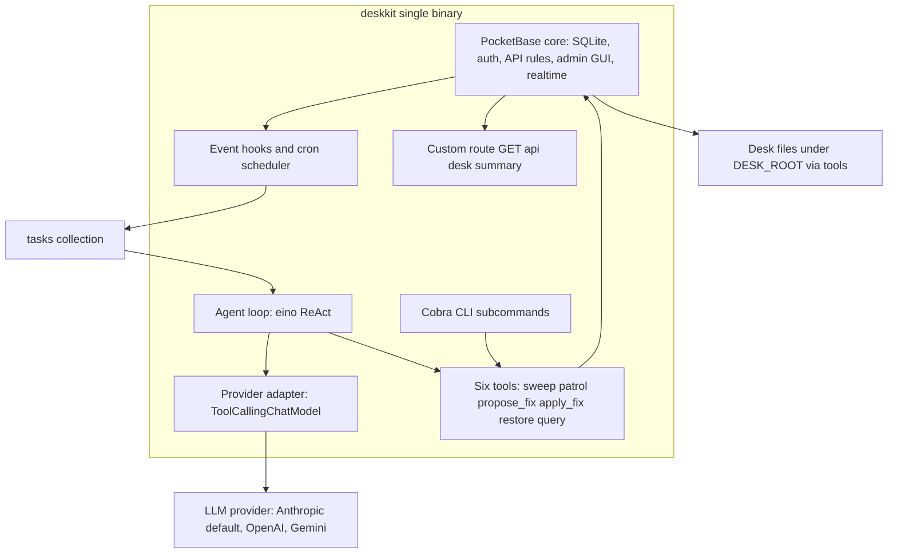
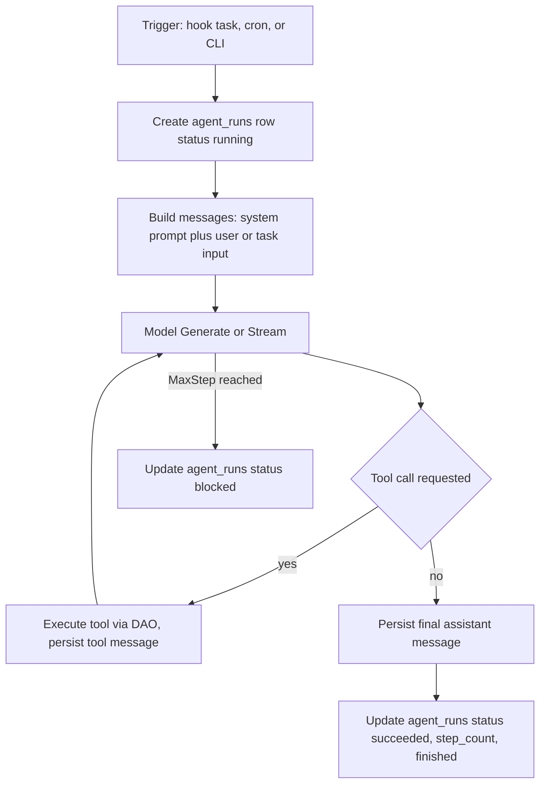

# deskkit — Product & Technical Specification

_The build spec for the single-binary Go agent that lives on the desk's PocketBase database, indexes and repairs desk files under a binding safety boundary, and is architected to grow into a broader desk agent._

Status: active
Date: 2026-07-15

## Table of contents

1. [Overview, goals, non-goals, and migration from the Python PoC](#1-overview-goals-non-goals-and-migration-from-the-python-poc)
2. [Architecture](#2-architecture)
3. [Tech stack & versions](#3-tech-stack--versions)
4. [Data model](#4-data-model)
5. [The six tools](#5-the-six-tools)
6. [Agent loop & provider adapter](#6-agent-loop--provider-adapter)
7. [Extension points](#7-extension-points)
8. [Phased build plan](#8-phased-build-plan)
9. [Testing & verification](#9-testing--verification)
10. [Operational](#10-operational)
11. [Out-of-scope + decisions appendix](#11-out-of-scope--decisions-appendix)

---

## 1. Overview, goals, non-goals, and migration from the Python PoC

### 1.1 What deskkit is

deskkit (named `pocket-librarian` through v0.6.0) is a single Go binary that is simultaneously a PocketBase database server and an
LLM-driven agent. The database is the agent's whole world: it is both the **state backend**
(conversation history, run logs, a task queue) and the **work surface** (an index of desk files,
patrol findings, and a record-original-first revision ledger the agent reads and edits through
tools). The agent owns its data through native Go DAO calls and real transactions rather than
talking to the database over REST.

The current Python proof of concept proved the librarian *behaviors* — sweep (index the tree),
patrol (flag rule violations), fix (repair mechanical violations under a safety boundary), and
restore (reverse any change) — as a set of scripts running *beside* a prebuilt PocketBase binary
with JavaScript hooks. This spec rewrites those behaviors as an agent that runs *inside* the
database process, adds an LLM agent loop with a provider-agnostic adapter, adds three new
state collections so the agent's conversation, run, and task-queue history are first-class,
queryable data, and adds a `prompts` collection that stores the agent's editable, versioned
system prompt as data rather than compiled-in code.

### 1.2 Goals

- **Preserve every proven behavior.** The six tools reproduce the exact detection logic (rules
  R1–R6), the safety boundary (decision 0014), and the byte-identical write/restore discipline of
  the Python PoC. A rebuild-from-scratch reproduces the same file index — measured as the same file
  **count and per-path checksum set** (§9.4 check 7), not full row equality.
- **Single binary.** One `go build` produces a binary that serves the database, exposes the admin
  GUI, runs the agent loop under `serve`, and offers CLI subcommands for the individual tools.
- **Provider-agnostic by construction.** Claude, OpenAI, and Gemini are swappable behind one Go
  interface, selected from configuration. Default provider is Anthropic Claude; default model is
  `claude-opus-4-8`.
- **Architected for role expansion.** Adding a new capability (a new tool) is a bounded change:
  implement one interface, register the tool, done — no re-architecture. The librarian is
  capability #1 of an agent that later grows into broader desk work.
- **Identity-neutral artifacts.** Nothing about a person, organization, repository, or desk is
  hardcoded. `DESK_ROOT`, `DESK_NAME`, path conventions, model id, and provider all come from
  config and environment. The shipped binary carries no personal identifiers.

### 1.3 Non-goals

- **Not a general chat assistant.** The agent's job is desk stewardship. Free-form generation is
  deliberately excluded — file content only ever comes from approved templates (§5, §11).
- **Not pb_hooks/goja and not a sidecar.** These runtimes are ruled out and mentioned only as
  context (§2.1). Do not re-litigate the runtime choice.
- **No future capabilities in this build.** Drafting decisions/issues, board sync, handoff
  refresh, and journal/task authoring are named as extension targets (§7) but are out of scope.
- **No timelines.** The phased plan (§8) states deliverables, acceptance criteria, and
  parallelism only.

### 1.4 Migration from the Python PoC

The Python PoC lives at the repository root: `scripts/{schema,sweep,librarian,assistant,desklib,pb_config}.py`,
`pb_hooks/{cron,routes}.pb.js`, `pb_migrations/*.js`, `templates/{pointer-stub,frontmatter-universal}.md`,
`bootstrap.sh`, and a `verify.sh` discipline. The migration path is additive and non-destructive:

| PoC artifact | Go successor | Migration note |
|---|---|---|
| `scripts/schema.py` (REST collection creation) | Go migrations under `migrations/` + `automigrate` | Same collections, same field order, same stable collection ids (§4). |
| `scripts/sweep.py` | `sweep` tool + CLI subcommand (§5.1) | Native `os.WalkDir` + DAO upsert instead of REST. |
| `scripts/librarian.py` (patrol + fix + restore) | `patrol`, `propose_fix`, `apply_fix`, `restore` tools (§5) | Same rule logic; the monolithic `--fix` splits into `propose_fix` (plan + store original) and `apply_fix` (commit the write) per §11. |
| `scripts/assistant.py` (read queries) | `query` tool + CLI subcommands (§5.6) | Native DAO reads. |
| `pb_hooks/cron.pb.js` | `app.Cron().Add(...)` in `serve` (§2.4) | Same `0 * * * *` schedule; enqueues a task instead of running inline. |
| `pb_hooks/routes.pb.js` | Go custom route in `OnServe` (§2.4) | `GET /api/desk/summary`, superuser-gated. |
| `scripts/pb_config.py`, `scripts/desklib.py` | `internal/config` + `internal/desklib` Go packages | Env discovery and helpers ported. |
| `templates/*.md` | embedded via `//go:embed` (§5, §11) | Templates ship inside the binary; still the only content source. |

The Python scripts remain runnable side by side during migration (they use the REST API; the Go
binary uses native DAO) — but **not against the same `pb_data` concurrently** (§10.4). The
recommended cutover is a clean rebuild against a fresh `pb_data` produced by the Go migrations,
verified reproducible against the real desk before the Python scripts are retired.

---

## 2. Architecture

### 2.1 Runtime model (settled — build on this)

deskkit imports PocketBase as a Go **library** (`pocketbase.New()`), registers its
collections, hooks, routes, and CLI commands, and runs the agent loop in-process. Tools are direct
DAO calls inside real transactions — there is no network hop between the agent and its data. The
prebuilt-binary + JS-hooks model (today's PoC) and a TypeScript sidecar were both evaluated and
rejected: goja/pb_hooks cannot host a tool-looping agent (no async/Promise/timers, no
fetch/streaming, no npm), and a sidecar cannot hold a transaction across the process boundary.
These are closed; they appear here only as the non-goal context that motivates the single-binary
design.

### 2.2 Component overview



### 2.3 The agent loop

The agent loop is an eino ReAct agent (`github.com/cloudwego/eino/flow/agent/react`). A run is
triggered three ways — a PocketBase event hook enqueuing a task, the hourly cron, or a manual CLI
invocation — and each run is one ReAct cycle bounded by `MaxStep`. The model receives a system
prompt describing the librarian role plus the available tools, decides which tool(s) to call,
receives each tool's JSON result appended as a tool message, and loops until it emits a final
answer or hits `MaxStep`. Every message and the run envelope are persisted to the `messages` and
`agent_runs` collections (§4). Loop and provider details are in §6.



### 2.4 How PocketBase hooks wake the agent

Two mechanisms drive the agent under `serve`:

- **Event hooks → task queue.** `app.OnRecordAfterCreateSuccess("files")` (and other record
  events) enqueue a `tasks` row rather than running the agent inline — this keeps the hook fast
  and non-blocking and makes the wake auditable. A background claimer goroutine started in
  `OnServe` polls `tasks` for `state = 'queued'`, claims one (transactional
  `queued → claimed`), runs the agent, and marks it `done`/`failed`. Example wake:

```go
app.OnRecordAfterCreateSuccess("files").BindFunc(func(e *core.RecordEvent) error {
    // A new file was indexed: enqueue a patrol task so the agent inspects it.
    coll, err := e.App.FindCollectionByNameOrId("tasks")
    if err != nil {
        return err
    }
    t := core.NewRecord(coll)
    t.Set("kind", "patrol")
    t.Set("payload", map[string]any{"file_id": e.Record.Id, "path": e.Record.GetString("path")})
    t.Set("state", "queued")
    t.Set("priority", 0)
    t.Set("source", "OnRecordAfterCreateSuccess:files")
    if err := e.App.Save(t); err != nil {
        return err
    }
    return e.Next()
})
```

- **Cron.** `app.Cron().Add("desk-patrol", "0 * * * *", fn)` reproduces `cron.pb.js`: it enqueues
  a `sweep` task then a `patrol` task each hour. On failure it writes a `patrol_log` row with
  `run_id = "cron-failure-<ISO>"` and a `summary`. The claimer processes the queued tasks.

**How a `tasks` row becomes work (kind → invocation).** A claimed task does **not** always spin up
the LLM. The `kind` selects the path:

- **Deterministic kinds — `sweep`, `patrol`, `propose_fix`, `apply_fix`, `restore`:** the claimer
  calls the tool **function directly** (no model, no ReAct loop), passing `payload` as its typed
  input. These are mechanical operations with fixed logic; running them through an LLM would add
  cost and nondeterminism for no benefit. (`apply_fix` via a task still obeys the §5.4
  autonomous-write gate: it only runs on this path when `LIBRARIAN_AUTONOMOUS_WRITES=true`;
  otherwise the enqueued `apply_fix` task is set to `deferred` (§4.9 `tasks.state`) and left for a
  supervised CLI run.)
- **Agentic kinds — `query`, `custom` (free-form):** the claimer starts an `agent_runs` row and
  runs the full eino ReAct loop (§6), letting the model choose tools to answer the request.

This split also resolves the write-safety story: an autonomous wake can index and flag freely, but
committing a write is either gated off (default) or routed to the human CLI.

**Claimer cadence & transactional claim (single goroutine).** One claimer goroutine started in
`OnServe` polls at a configurable interval (`CLAIMER_POLL_INTERVAL`, default `5s`) for the
highest-priority `queued` task. It claims inside `app.RunInTransaction`, **re-checking
`state == "queued"` inside the transaction** before flipping to `claimed` (so a second poll or a
future second claimer cannot double-run a task), then runs the mapped work outside the claim
transaction and marks `done`/`failed`.

The custom route mirrors `routes.pb.js`:

```go
app.OnServe().BindFunc(func(se *core.ServeEvent) error {
    se.Router.GET("/api/desk/summary", func(e *core.RequestEvent) error {
        // aggregate files + open findings (see §5.6 summary query)
        return e.JSON(200, buildSummary(e.App))
    }).Bind(apis.RequireSuperuserAuth()) // verified: superuser-gating middleware (§11.3)
    return se.Next()
})
```

### 2.5 Provider-agnostic adapter

The swap point is eino's `model.ToolCallingChatModel` interface. A small factory reads
`LLM_PROVIDER` and constructs the matching eino-ext component (Claude, OpenAI, or Gemini), all of
which satisfy the interface. The ReAct agent is wired to the returned interface value and never
names a concrete provider. Full interface and wiring in §6.

### 2.6 Tool registration

Each tool is an eino `tool.InvokableTool`. Tools are built once at startup (they close over the
`core.App`) and registered in `react.AgentConfig.ToolsConfig.Tools`. The same tool functions back
the Cobra CLI subcommands, so `sweep` behaves identically whether the agent calls it or an
operator runs `deskkit sweep`. Registration detail in §5 and §7.

### 2.7 Deployment / run model

- **`deskkit serve`** — starts the DB server, admin GUI, realtime, custom route, cron,
  event hooks, and the task-claimer goroutine that hosts the agent loop. This is the long-running
  process.
- **`deskkit <tool>`** — one-shot CLI subcommands (`sweep`, `patrol`, `apply-fix`,
  `restore`, `query …`) that run the tool directly and exit. These run in a **separate process**
  from `serve`; PocketBase console commands do not share the serve process's hooks/realtime, so a
  CLI `sweep` will not itself fire the file-created hook chain. The agent loop only lives under
  `serve`.
- **Migrations** run automatically on startup (`Automigrate: true`) and can be invoked explicitly
  via `deskkit migrate up`.

Single deployment artifact: the binary plus its SQLite store directory. The store is **not**
a cwd-relative `pb_data/` by default — it resolves to the canonical, per-desk location
described in §10.6, overridable with `--dir`. No external services beyond the chosen LLM
provider's HTTPS API.

**Single-writer operating rule (SQLite).** The store is a SQLite database with one writer at
a time. The one-shot CLI subcommands and `serve` must **not** run against the same store
concurrently: a one-shot tool assumes `serve` is stopped (or opens the DB in a mode that fails fast
on a busy lock rather than blocking indefinitely). Operationally: the autonomous path is
`serve` + the claimer; **supervised fixes stop `serve` first**, run `apply-fix`/`restore`, then
restart `serve`. This is the same constraint that governs coexistence with the Python PoC (§10.4).

### 2.8 Repository layout

The single Go module (module path `github.com/hsb3/desk-standard/librarian`, §3.1) is laid out so the
six tool implementations, the provider adapter, the migrations, `main`, and config each have one
home. `internal/` keeps them un-importable from outside the module.

```text
librarian/
├── cmd/deskkit/
│   └── main.go              # entry: pocketbase.New(), migratecmd, hooks, route, cron,
│                            #   CLI (cobra) wiring, agent registration (§2.4, §4.11, §6)
├── migrations/              # Go up/down migrations, blank-imported by main (§4.11)
│   ├── 0001_files.go
│   ├── 0002_patrol_findings.go
│   ├── 0003_patrol_log.go
│   ├── 0004_revisions.go
│   ├── 0005_adoption_log.go
│   ├── 0006_agent_runs.go   # before messages/tasks (relation parent)
│   ├── 0007_messages.go
│   ├── 0008_tasks.go
│   └── 0009_prompts.go      # editable/versioned system prompt (§4.10); no relations, any order
├── internal/
│   ├── config/              # env discovery + .env walk-up (§3.4); ports pb_config.py
│   ├── desklib/             # helpers ported from desklib.py: checksum, frontmatter parse,
│   │                        #   git meta, write_exact, is_ignored (§5.1/§5.3/§5.4)
│   ├── tools/               # the six tool impls (each = CLI-backing function + eino tool):
│   │   ├── sweep.go         #   §5.1
│   │   ├── patrol.go        #   §5.2
│   │   ├── propose_fix.go   #   §5.3
│   │   ├── apply_fix.go     #   §5.4
│   │   ├── restore.go       #   §5.5
│   │   └── query.go         #   §5.6
│   ├── agent/               # eino ReAct loop, runCtx, single persistence callback,
│   │   ├── agent.go         #   claimer goroutine (§6, §2.4 — claimer is Phase 2)
│   │   ├── persist.go
│   │   └── claimer.go
│   └── provider/
│       └── adapter.go       # newChatModel factory: anthropic|openai|gemini (§6.3)
├── templates/               # frontmatter-universal.md, pointer-stub.md — //go:embed (§5, §11)
├── .librarian-ignore        # auto-created from embedded defaults on first run (§10.1)
├── Makefile                 # task interface (§9.5)
├── go.mod
└── go.sum
```

The SQLite store is **not** part of this tree — by default it lives outside the repo, at the
canonical `XDG_DATA_HOME`-derived path (§10.6), not a repo-root `pb_data/`. `--dir` can still
point a store at a repo-local path (e.g. for a throwaway test desk); such a dir would need its
own gitignore entry.

---

## 3. Tech stack & versions

### 3.1 Versions

| Component | Version / value | Notes |
|---|---|---|
| Go | **1.25** (resolved floor); build with a 1.25.x toolchain | Driven by the PocketBase v0.39.6 dependency: its `go.mod` declares `go 1.25.0` (verified against the v0.39.6 `go.mod`). The eino-ext claude/gemini components require `go 1.24`, so 1.25 satisfies the whole graph. A `go 1.23` directive will **not** compile. |
| PocketBase (library) | `github.com/pocketbase/pocketbase v0.39.6` | Library tag equals the binary version. Uses the v0.23+ `core.Collection` / `core.*Field` API, not the old `models`/`schema` API. |
| eino core | `github.com/cloudwego/eino v0.9.12` | `go.mod` declares `go 1.18`. |
| eino-ext Claude | `github.com/cloudwego/eino-ext/components/model/claude v0.1.22` | Default provider. |
| eino-ext Gemini | `github.com/cloudwego/eino-ext/components/model/gemini v0.1.33` | Takes a `*genai.Client`, not an API-key field. |
| eino-ext OpenAI | `github.com/cloudwego/eino-ext/components/model/openai v0.1.13` | Latest tag, verified via `proxy.golang.org`. (Re-run `go get …@latest` at build time to confirm the current patch.) |
| eino-ext tool utils | `github.com/cloudwego/eino/components/tool/utils` | `utils.InferTool` / `utils.NewTool` (import path verified — §11.3). |
| google genai SDK | `google.golang.org/genai v1.36.0` | Gemini client dependency (a v1 module; the version the gemini component v0.1.33 requires). Resolved transitively by the gemini component. |
| cobra | `github.com/spf13/cobra` | CLI subcommands (bundled with PocketBase's `RootCmd`). |
| dbx | `github.com/pocketbase/dbx` | `dbx.Params` for filter binding. |

Module path: **`github.com/hsb3/desk-standard/librarian`** — graduated from the identity-neutral
`github.com/example/pocket-librarian` placeholder used pre-publication; a Go module path is
compile-time public API and cannot be routed through `_knowledge/profile.yaml` like an ordinary
hardcoded identifier (schema/neutrality-lint.allow carries the token-scoped sanctioned-escape
entries for it). Nothing else in the code references it.

### 3.2 Dependency list (`go.mod` direct requires)

```
module github.com/hsb3/desk-standard/librarian

go 1.25 // resolved floor: PocketBase v0.39.6 go.mod declares go 1.25.0 (verified). Use a 1.25.x toolchain.

require (
    github.com/pocketbase/pocketbase v0.39.6
    github.com/pocketbase/dbx v1.x            // resolved transitively by pocketbase; pin what go.sum yields
    github.com/cloudwego/eino v0.9.12
    github.com/cloudwego/eino-ext/components/model/claude v0.1.22
    github.com/cloudwego/eino-ext/components/model/gemini v0.1.33
    github.com/cloudwego/eino-ext/components/model/openai v0.1.13 // latest, verified via proxy.golang.org
    google.golang.org/genai v1.36.0             // resolved by the gemini component (v1 module)
    github.com/spf13/cobra v1.x                 // resolved transitively by pocketbase
)
```

Note the machine-wide supply-chain policy (7-day install cooldown, no install scripts, no
non-registry sources). All the above are registry modules; `go get` is unaffected by the npm/pip
cooldown, but if any tag was published in the last 7 days the team should pin the prior tag or
wait out the window rather than disabling protection.

### 3.3 Build & run commands

```bash
# Build the single binary.
go build -o deskkit ./cmd/deskkit

# Run the server (DB + admin GUI + agent loop + cron + hooks).
./deskkit serve --http=127.0.0.1:8090

# One-shot tools (separate process, no agent loop).
./deskkit sweep
./deskkit patrol                        # dry-run: files findings, NO fs writes
./deskkit propose-fix --run <run_id>    # plan + record originals; NO fs writes
./deskkit apply-fix --run <run_id>      # supervised commit; never a Makefile default target
./deskkit restore --revision <id>
./deskkit restore --by-path <path>      # latest applied, unrestored revision for <path>; falls back to an FS-confirmed half-applied move (§5.4)
./deskkit query recent --days 7

# Admin GUI + migrations.
./deskkit gui                           # convenience: serve, open the admin GUI
./deskkit migrate up                    # explicit; also runs automatically on serve
```

**Full subcommand surface.** There is **no `patrol --fix`** — the monolithic fix path is split
into `propose-fix` and `apply-fix` (§5.3/§5.4, §11.2). The complete set:

| Subcommand | Purpose | Writes desk files? |
|---|---|---|
| `serve` | Long-running DB + GUI + agent loop + cron + hooks + claimer | via the gated agent only |
| `sweep` | Reindex the tree | no |
| `patrol` | Dry-run: file findings + one log row | no |
| `propose-fix` | Plan mechanical fixes, record originals to `revisions` | no |
| `apply-fix` | Commit recorded revisions byte-exact (supervised) | **yes** |
| `restore` | Reverse a change to the recorded original | yes (restores) |
| `query` | Read-only queries (`live_files`/`recent`/`orphans`/`uncollapsed`/`findings`/`summary`/`adoption`) | no |
| `agent` | Run the agent loop once on an instruction (manual trigger, Phase 1) | via the gated agent only |
| `mcp-serve` | Expose the six-tool core as an MCP stdio server (model-facing; §7.2) | via gated `apply_fix` only |
| `migrate up` | Apply migrations explicitly | no (schema) |
| `gui` | Serve + admin GUI | no |

### 3.4 Config & environment variables

Secrets (API keys, superuser password) come from the environment; a `.env` is discovered by
walking up from the working directory and never overrides an already-set process env var.

| Env var | Default | Purpose |
|---|---|---|
| `PB_URL` | `http://127.0.0.1:8090` | Retained for the admin GUI / any REST client and for the CLI tools' health checks. The in-process agent does **not** use it (native DAO). |
| `PB_SUPERUSER_EMAIL` | (none) | Admin GUI + REST auth; created on first run if absent. |
| `PB_SUPERUSER_PASSWORD` | (none) | As above. Secret — env only. |
| `DESK_ROOT` | (none; must be set) | Absolute path to the desk directory the librarian stewards. Identity-neutral: no default that names a person. |
| `DESK_NAME` | (none; must be set) | Stamped into `desk` fields. Identity-neutral. |
| `DECISIONS_DIR` | `_structure/decisions` | Configurable path constant; entity-dir map key `decision` (§5.1 dir_kind derivation; §11 path-drift decision). |
| `TASKS_DIR` | `tasks` | Configurable path constant; entity-dir map key `task` (§5.1). |
| `ANALYSES_DIR` | `analyses` | Configurable path constant; entity-dir map key `analysis` (§5.1). |
| `JOURNAL_DIR` | `journal` | Configurable path constant; entity-dir map key `journal` (§5.1). |
| `SECRETS_DIR` | `_meta/secrets` | Configurable path constant (§11). |
| `IGNORE_CONFIG` | `<DESK_ROOT>/.librarian-ignore` | Path to the operator-editable ignore list; single source of truth for write-protection. |
| `HANDOFF_PATH` | `_meta/HANDOFF.md` | Configurable target for the R6 staleness rule (§5.2). Identity-neutral. |
| `LIBRARIAN_AUTONOMOUS_WRITES` | `false` | Registration-time gate (§5.4): when `false`, the autonomous `serve` agent gets no `apply_fix` tool. |
| `CLAIMER_POLL_INTERVAL` | `5s` | Task-claimer poll cadence (§2.4). |
| `LLM_PROVIDER` | `anthropic` | `anthropic` \| `openai` \| `gemini`. |
| `LLM_MODEL` | `claude-opus-4-8` | Model id for the selected provider. Current alternates: `claude-sonnet-5`, `claude-haiku-4-5`, `gpt-5.4`, `gemini-3-pro-preview`. |
| `LLM_MAX_TOKENS` | `4096` | Provider max output tokens. |
| `AGENT_MAX_STEP` | `12` | eino ReAct `MaxStep`. |
| `ANTHROPIC_API_KEY` | (none) | Required when provider = anthropic. Secret — env only. |
| `OPENAI_API_KEY` | (none) | Required when provider = openai. |
| `GEMINI_API_KEY` | (none) | Required when provider = gemini. |
| `XDG_DATA_HOME` | (unset) | Base dir for the canonical store location when `--dir` is absent; see §10.6. |

Note the `DESK_ROOT` default in the Python PoC (`/Users/henry/Documents/EXECUTIVE_DESK/Projects/dev-tooling-desk`)
is **not** carried into the Go binary — per identity-neutrality (§11), `DESK_ROOT`/`DESK_NAME` are
required config with no personal default.

**Store location is not a `DESK_ROOT`-relative env var; see §10.6** for the canonical
`XDG_DATA_HOME`-derived default, the `--dir` override, and the desk open-guard — decided in
[`docs/decisions/0002-multi-desk-topology-store-per-desk.md`](decisions/0002-multi-desk-topology-store-per-desk.md).

---

## 4. Data model

All collections are `type: base`. Every API rule (list/view/create/update/delete) is `nil`, which
in PocketBase means **superuser-only** — no public access. PocketBase auto-adds the system `id`
field (text, primary key, 15 chars, pattern `^[a-z0-9]+$`, autogenerated `[a-z0-9]{15}`) to every
collection; it is not listed below. The five existing collections reproduce the PoC exactly,
including field order and stable collection ids; the four new collections (`messages`,
`agent_runs`, `tasks`, and the `prompts` data surface) are fully specified with justification.

### 4.1 Stable collection ids (preserve when reusing migrations)

| Collection | Stable id |
|---|---|
| `files` | `pbc_3446931122` |
| `patrol_findings` | `pbc_134268848` |
| `patrol_log` | `pbc_3052838673` |
| `revisions` | `pbc_3986342941` |
| `adoption_log` | `pbc_2776405824` |
| `messages` | new — id may autogenerate (no cross-reference by literal id required) |
| `agent_runs` | new — as above |
| `tasks` | new — as above |
| `prompts` | `pbc_1968329054` — assigned (stable, for a reproducible embedded-default seed, §4.10) |

### 4.2 `files` — one row per file under `DESK_ROOT`

| # | Field | Type | Constraints / notes |
|---|---|---|---|
| 1 | `path` | text | Required. Relative to `DESK_ROOT`. Unique index `idx_files_path`. |
| 2 | `doc_id` | text | Optional frontmatter `id` — the document-identity primitive (migration 0018, ADR 0017). Sweep matches on it FIRST (falling back to `path`) so a renamed doc keeps its row; `""` when the doc carries no `id`. Named `doc_id`, not `id`, because PocketBase reserves `id` for the record's own primary key. |
| 3 | `desk` | text | Stamped with `DESK_NAME`. |
| 4 | `doctype` | text | Frontmatter `type`, or `""` (migration 0019 renamed this column, ADR 0017 — the prior name collided with an unrelated schema enum of the same name; only the column name changed, not the value). |
| 5 | `dir_kind` | select (maxSelect 1) | Values: `decisions`, `tasks`, `analyses`, `journal`, `meta`, `memory`, `root`, `other`, `infra` (`infra` added in migration 0012 — dotted infra dirs; §5.1/§5.6). |
| 6 | `status` | text | Frontmatter `status`, or `""`. |
| 7 | `synopsis` | text | Frontmatter `synopsis`. |
| 8 | `origin` | text | Git first-add `"<hash>|<yyyy-mm-dd>"`. |
| 9 | `graduated_to` | text | The doc's explicit graduation marker target (`wb#N` / `#N` / URL), or `""` if none is declared (§5.1). |
| 10 | `checksum` | text | sha256 hex of raw file bytes. |
| 11 | `git_last_commit` | text | Git last-commit `"<hash>|<yyyy-mm-dd>"`. |
| 12 | `fm_created` | text | Frontmatter `created`. |
| 13 | `fm_updated` | text | Frontmatter `updated`. |
| 14 | `last_seen` | date | Set on create/update during sweep. |
| 15 | `deleted` | bool | Soft-delete flag. |

Index: `idx_files_path` UNIQUE on `path`.

### 4.3 `patrol_findings`

Dedupe key `(path, rule, checksum)` is enforced **in application code** (no DB index) — the code
never refiles an open finding for unchanged content.

| Field | Type | Notes |
|---|---|---|
| `file` | relation → `files` (`pbc_3446931122`) | maxSelect 1, minSelect 0, cascadeDelete false. |
| `rule` | text | e.g. `"R1"`. |
| `severity` | select (1) | Values: `mechanical`, `judgment`. |
| `detail` | text | Human-readable finding. |
| `proposed_fix` | text | Suggested remedy. |
| `state` | select (1) | Values: `flagged`, `fixed`, `resolved`. Code always creates `flagged`. (`dismissed` retired by migration `0015` — the disposition axis replaced it; `resolved` added by `0010`.) |
| `patrol_run` | text | `run_id`. |
| `checksum` | text | Checksum of the flagged file at flag time; part of the dedupe key. |
| `disposition` | select (1) | Values: `open`, `acknowledged`, `triaged`, `wont_fix`. Added by migration `0014` — a supervisor's triage decision, orthogonal to `state` (a finding can stay `flagged` while dispositioned). Defaults to `open` (backfilled on existing rows); the default `query findings` view filters `disposition='open'`. Inherited by the dedupe key `(file, rule, checksum)` on re-fire, alongside its `actor`/`reason`/`disposed_at` provenance. |
| `actor` | text | Max 200. Disposition provenance: who dispositioned the finding. Free text, no baked default. Empty on `open` findings. |
| `reason` | text | Max 2000. Disposition provenance: why. Optional for every disposition (a `wont_fix` MAY stay anonymous, though a reason is recommended). Empty on `open` findings. |
| `disposed_at` | date | Disposition provenance: when the finding moved to a non-`open` disposition. Plain date (set at dispose time, NOT an autodate). Cleared when a finding returns to `open`. |

### 4.4 `patrol_log`

| Field | Type | Notes |
|---|---|---|
| `run_id` | text | `"patrol-<UTC compact ISO>"` or `"cron-failure-<iso>"`. |
| `desk` | text | `DESK_NAME`. |
| `started` | date | |
| `finished` | date | |
| `files_swept` | number | onlyInt false. |
| `findings_new` | number | onlyInt false. |
| `summary` | text | |

### 4.5 `revisions` — record-original-first ledger (decision 0014)

| Field | Type | Notes |
|---|---|---|
| `path` | text | Required. Original relative path. |
| `action` | select (1) | Values: `edit`, `move`, `delete` (only `edit`/`move` are used). |
| `original_content` | text | Complete original file content, utf-8 decoded. |
| `original_checksum` | text | sha256 hex of original bytes. |
| `new_path` | text | Destination for moves. |
| `finding` | relation → `patrol_findings` (`pbc_134268848`) | maxSelect 1, minSelect 0, cascadeDelete false. |
| `applied` | bool | Flipped true after the FS write succeeds. |
| `restored` | bool | Flipped true by restore. |
| `run_id` | text | Patrol run that produced it. |
| `created` | autodate | onCreate true. |
| `updated` | autodate | onCreate true, onUpdate true. |

### 4.6 `adoption_log`

| Field | Type | Notes |
|---|---|---|
| `date` | date | |
| `desk` | text | `DESK_NAME`. |
| `event` | select (1) | Values: `fix`. Shrunk to writer-backed reality by migration `0017` — the original six (`patrol`, `revert`, `false_positive`, `friction`, `note`) had no writer; a new event is wired only when a concrete consumer pulls it. |
| `detail` | text | |

### 4.7 NEW: `messages` — conversation history per agent run

One row per message in an agent conversation. This makes the ReAct transcript first-class,
queryable data (auditable, replayable, and the substrate for future memory features).

| Field | Type | Constraints / justification |
|---|---|---|
| `run` | relation → `agent_runs` | maxSelect 1, minSelect 1, cascadeDelete true. A message belongs to exactly one run; deleting a run removes its transcript. **The relation targets the `agent_runs` record's system `id` (the 15-char PocketBase id), never the human-readable `run_label` field (§4.8, §6.5).** |
| `seq` | number | onlyInt true, min 0. Monotonic per-run ordering — `created` autodate alone is insufficient because several messages can be written in the same second within one loop step. Index `(run, seq)`. |
| `role` | select (1) | Values: `system`, `user`, `assistant`, `tool`. Mirrors eino `schema.RoleType`. |
| `content` | text | Message text. `text` (not `editor`) because content is plain, not rich HTML, and must round-trip byte-exact for replay. |
| `tool_calls` | json | Assistant tool-call array (each: id, function name, arguments JSON). Empty for non-assistant or non-tool-calling messages. |
| `tool_call_id` | text | For `tool` role: the id of the call this message answers. |
| `tool_name` | text | For `tool` role: the tool that produced the result (denormalized for cheap filtering/analytics). |
| `created` | autodate | onCreate true. |

Indexes: `idx_messages_run_seq` on `(run, seq)` (non-unique is acceptable, but unique better
guards double-writes — default to **unique** so a retried persist cannot duplicate a step);
`idx_messages_run` on `(run)` for transcript fetch.

### 4.8 NEW: `agent_runs` — one row per agent invocation

The run envelope: who triggered it, which provider/model, how it ended, and a step count for the
`MaxStep` guard audit.

| Field | Type | Constraints / justification |
|---|---|---|
| `trigger` | select (1) | Values: `hook`, `cron`, `manual`, `task`. How the run started. |
| `status` | select (1) | Values: `running`, `succeeded`, `failed`, `blocked`. `blocked` = hit `MaxStep` without a final answer. Set `running` at creation; terminal state at end. |
| `provider` | text | e.g. `anthropic`. Free text because provider set is open (adapter-driven), not fixed. |
| `model` | text | e.g. `claude-opus-4-8`. |
| `run_label` | text | Human-readable run label, e.g. `run-20260715T101010Z` (or a `patrol-…` label for a patrol-driven run). **This is a display/label field only — it is NOT the record id and is NEVER the target of the `messages.run` relation.** The relation always targets the record's system `id` (the 15-char PocketBase id, §4). Keeping the label distinct from the id is what makes the relation valid (§6.5). |
| `input_summary` | text | Short description of the triggering request/task. |
| `output_summary` | text | Short description of the outcome. |
| `step_count` | number | onlyInt true, min 0. ReAct steps consumed. |
| `error` | text | Error message when `status = failed`. |
| `started` | date | Set at creation. |
| `finished` | date | Set at terminal state. |
| `created` | autodate | onCreate true. |

Index: `idx_agent_runs_status` on `(status)` (the claimer and dashboards filter running/blocked
runs); optional `idx_agent_runs_created` on `(created)` for recency queries.

### 4.9 NEW: `tasks` — the queue hooks enqueue to wake the agent

Decouples the fast event hook from the slow agent run and makes every wake auditable and
retryable.

| Field | Type | Constraints / justification |
|---|---|---|
| `kind` | select (1) | Values: `sweep`, `patrol`, `propose_fix`, `apply_fix`, `restore`, `query`, `custom`. What the agent should do. Deterministic kinds (`sweep`/`patrol`/`propose_fix`/`apply_fix`/`restore`) are dispatched directly to the tool function; agentic kinds (`query`/`custom`) run the LLM loop (§2.4). Every enum value has a defined dispatch path — see §2.4. An enqueued `apply_fix` only executes autonomously when `LIBRARIAN_AUTONOMOUS_WRITES=true` (§5.4 gate); otherwise it is set to `deferred` (see `state` below) for a supervised CLI run. |
| `payload` | json | Task-specific input (e.g. `{"file_id": "...", "path": "..."}`). |
| `state` | select (1) | Values: `queued`, `claimed`, `done`, `failed`, `deferred`. Claim transition `queued → claimed` is transactional so two claimers cannot double-run a task. `deferred` is the terminal state for an autonomous `apply_fix` task whose §5.4 write gate is off — it is not re-picked by the claimer, and completion happens via a supervised CLI run. |
| `priority` | number | onlyInt true, default 0. Higher runs first; the claimer orders by `-priority, created`. |
| `source` | text | Origin, e.g. the hook name `OnRecordAfterCreateSuccess:files` or `cron:desk-patrol`. |
| `claimed_at` | date | Set when claimed. |
| `finished_at` | date | Set when done/failed. |
| `result` | relation → `agent_runs` | maxSelect 1, minSelect 0, cascadeDelete false. Links the task to the run it produced. (Chosen relation over free text so the run's full record is one hop away; the PoC ground-truth allowed either — relation is the more useful default.) |
| `created` | autodate | onCreate true. |

Index: `idx_tasks_state_priority` on `(state, priority)` — the hot path is "next queued task by
priority."

### 4.10 NEW: `prompts` — editable, versioned system prompt (data surface)

The agent's system prompt is **data, not compiled-in Go**. This collection holds the librarian's
system prompt as an editable, versioned row so an operator can groom it through the admin GUI/REST
without rebuilding the binary. The embedded default (§6.1) is `//go:embed`'d and seeded here on
first run; at run start the agent loads the active row and falls back to the embedded default if the
collection is empty. This realizes the identity-neutral / data-surface posture (decision 0013
item 9): personalization is data the generic system reads, not hardcoded prompt text.

| Field | Type | Constraints / justification |
|---|---|---|
| `key` | text | Required. Logical prompt identifier, e.g. `librarian.system`. Lets future capabilities carry their own prompts under distinct keys. |
| `name` | text | Human-readable label, e.g. "Librarian system prompt". |
| `content` | text | The prompt body. `text` (not `editor`) — plain text that must round-trip byte-exact (same rationale as `messages.content`, §4.7). |
| `version` | number | onlyInt true, min 0. Monotonic per `key`; the highest-`version` `active` row wins at load. |
| `active` | bool | Exactly one row per `key` is active; an edit promotes a new version row and moves the flag (history retained). |
| `created` | autodate | onCreate true. |
| `updated` | autodate | onCreate true, onUpdate true. |

Stable id `pbc_1968329054` (assigned, like the five existing collections, so the seeded default is
reproducible across rebuilds). All API rules left nil ⇒ **superuser-only** (no public access).
Index: `idx_prompts_key_active` on `(key, active)` — the load path is "the active row for this
key"; optional `idx_prompts_key_version` on `(key, version)` for history browsing.

**Seeding & load (mirrors the `.librarian-ignore` auto-create, §10.1).** On first run, if no row
exists for `key = "librarian.system"`, the binary inserts one from the embedded default
(`content` = the verbatim §6.1 text, `version = 1`, `active = true`) — the collection is **seeded,
never user-required**. At run start the agent loads the active, highest-`version` row (§6.1) and
interpolates desk facts; a missing/empty collection falls back to the embedded default so the agent
always has a prompt. GUI/REST edits take effect on the **next** run.

**Governance ([ADR 0015](decisions/0015-prompt-governance.md) — git is truth).** "Editable,
versioned" is an operator convenience, **not** a durability promise. The version-controlled
embedded default (§6.1) is **canonical**; the `prompts` row it seeds is a **re-seeded cache**. A
GUI/REST edit to that row is **ephemeral by rule** — it applies on the next run but does not
survive a store rebuild/re-seed, and clearing the row is the intended **"reset to shipped"** path
(the embed re-seeds, §6.1), not data loss. The only durable customization path is `_knowledge/`
personalization (the profile) — never a DB prompt edit, never an edit to a shipped artifact. The
DB row therefore does not compete with the embed for truth: the embed↔spec-quote copies stay
byte-identical under a drift guard, and the row is a cache the resolver prefers when present.

### 4.11 Migrations, automigrate, and rebuild reproducibility

Collections are defined in Go migrations under `migrations/` and blank-imported from `main`:

```go
import (
    "github.com/pocketbase/pocketbase"
    "github.com/pocketbase/pocketbase/plugins/migratecmd"
    _ "github.com/hsb3/desk-standard/librarian/migrations" // blank-import registers all migrations
)

func main() {
    app := pocketbase.New()
    migratecmd.MustRegister(app, app.RootCmd, migratecmd.Config{
        Automigrate: true, // confirm: template may key off osutils.IsProbablyGoRun() (§11.3 open item 1)
    })
    // ... register hooks, route, cron, tools, agent (see §2, §5, §6) ...
    if err := app.Start(); err != nil {
        log.Fatal(err)
    }
}
```

Each migration registers an up/down pair:

```go
package migrations

import (
    "github.com/pocketbase/pocketbase/core"
    m "github.com/pocketbase/pocketbase/migrations"
)

func init() {
    m.Register(func(app core.App) error { // up
        files := core.NewBaseCollection("files")
        files.Id = "pbc_3446931122" // preserve stable id for reproducibility
        files.Fields.Add(&core.TextField{Name: "path", Required: true})
        files.Fields.Add(&core.TextField{Name: "desk"})
        files.Fields.Add(&core.TextField{Name: "doctype"})
        files.Fields.Add(&core.SelectField{Name: "dir_kind", MaxSelect: 1,
            // "infra" added in migration 0012 (fresh stores carry it here; 0012 alters existing).
            Values: []string{"decisions", "tasks", "analyses", "journal", "meta", "memory", "root", "other", "infra"}})
        files.Fields.Add(&core.TextField{Name: "status"})
        files.Fields.Add(&core.TextField{Name: "synopsis"})
        files.Fields.Add(&core.TextField{Name: "origin"})
        files.Fields.Add(&core.TextField{Name: "graduated_to"})
        files.Fields.Add(&core.TextField{Name: "checksum"})
        files.Fields.Add(&core.TextField{Name: "git_last_commit"})
        files.Fields.Add(&core.TextField{Name: "fm_created"})
        files.Fields.Add(&core.TextField{Name: "fm_updated"})
        files.Fields.Add(&core.DateField{Name: "last_seen"})
        files.Fields.Add(&core.BoolField{Name: "deleted"})
        files.AddIndex("idx_files_path", true, "path", "")
        // All api rules left nil => superuser-only. (ListRule/ViewRule/... default to nil.)
        return app.Save(files)
    }, func(app core.App) error { // down
        c, _ := app.FindCollectionByNameOrId("files")
        if c != nil {
            return app.Delete(c)
        }
        return nil
    })
}
```

The four **new** collections use the relation/json/number/bool/autodate field structs. Their
up-migrations are below (field order per the §4.7–4.10 tables; `agent_runs` must migrate **before**
`messages`/`tasks` because both relate to it; `prompts` has no relations and may migrate in any
order); each `down` half mirrors the files example (`FindCollectionByNameOrId` + `Delete`):

```go
// agent_runs (§4.8) — migrate before messages/tasks.
runs := core.NewBaseCollection("agent_runs")
runs.Fields.Add(&core.SelectField{Name: "trigger", MaxSelect: 1, Values: []string{"hook", "cron", "manual", "task"}})
runs.Fields.Add(&core.SelectField{Name: "status", MaxSelect: 1, Values: []string{"running", "succeeded", "failed", "blocked"}})
runs.Fields.Add(&core.TextField{Name: "provider"})
runs.Fields.Add(&core.TextField{Name: "model"})
runs.Fields.Add(&core.TextField{Name: "run_label"}) // display label, NOT the messages.run relation target
runs.Fields.Add(&core.TextField{Name: "input_summary"})
runs.Fields.Add(&core.TextField{Name: "output_summary"})
runs.Fields.Add(&core.NumberField{Name: "step_count", OnlyInt: true, Min: types.Pointer(0.0)})
runs.Fields.Add(&core.TextField{Name: "error"})
runs.Fields.Add(&core.DateField{Name: "started"})
runs.Fields.Add(&core.DateField{Name: "finished"})
runs.Fields.Add(&core.AutodateField{Name: "created", OnCreate: true})
runs.AddIndex("idx_agent_runs_status", false, "status", "")
if err := app.Save(runs); err != nil { return err }

// messages (§4.7) — relation targets the agent_runs record id.
msgs := core.NewBaseCollection("messages")
msgs.Fields.Add(&core.RelationField{Name: "run", CollectionId: runs.Id, MaxSelect: 1, MinSelect: 1, CascadeDelete: true})
msgs.Fields.Add(&core.NumberField{Name: "seq", OnlyInt: true, Min: types.Pointer(0.0)})
msgs.Fields.Add(&core.SelectField{Name: "role", MaxSelect: 1, Values: []string{"system", "user", "assistant", "tool"}})
msgs.Fields.Add(&core.TextField{Name: "content"})
msgs.Fields.Add(&core.JSONField{Name: "tool_calls"})
msgs.Fields.Add(&core.TextField{Name: "tool_call_id"})
msgs.Fields.Add(&core.TextField{Name: "tool_name"})
msgs.Fields.Add(&core.AutodateField{Name: "created", OnCreate: true})
msgs.AddIndex("idx_messages_run_seq", true, "run, seq", "") // unique guards a retried persist
msgs.AddIndex("idx_messages_run", false, "run", "")
if err := app.Save(msgs); err != nil { return err }

// tasks (§4.9) — relation to agent_runs.
tasks := core.NewBaseCollection("tasks")
tasks.Fields.Add(&core.SelectField{Name: "kind", MaxSelect: 1, Values: []string{"sweep", "patrol", "propose_fix", "apply_fix", "restore", "query", "custom"}})
tasks.Fields.Add(&core.JSONField{Name: "payload"})
tasks.Fields.Add(&core.SelectField{Name: "state", MaxSelect: 1, Values: []string{"queued", "claimed", "done", "failed", "deferred"}})
tasks.Fields.Add(&core.NumberField{Name: "priority", OnlyInt: true}) // default 0
tasks.Fields.Add(&core.TextField{Name: "source"})
tasks.Fields.Add(&core.DateField{Name: "claimed_at"})
tasks.Fields.Add(&core.DateField{Name: "finished_at"})
tasks.Fields.Add(&core.RelationField{Name: "result", CollectionId: runs.Id, MaxSelect: 1, MinSelect: 0, CascadeDelete: false})
tasks.Fields.Add(&core.AutodateField{Name: "created", OnCreate: true})
tasks.AddIndex("idx_tasks_state_priority", false, "state, priority", "")
if err := app.Save(tasks); err != nil { return err }

// prompts (§4.10) — no relations; may migrate in any order. Stable id assigned so the seeded
// embedded default is reproducible across rebuilds.
prompts := core.NewBaseCollection("prompts")
prompts.Id = "pbc_1968329054"
prompts.Fields.Add(&core.TextField{Name: "key", Required: true})
prompts.Fields.Add(&core.TextField{Name: "name"})
prompts.Fields.Add(&core.TextField{Name: "content"})
prompts.Fields.Add(&core.NumberField{Name: "version", OnlyInt: true, Min: types.Pointer(0.0)})
prompts.Fields.Add(&core.BoolField{Name: "active"})
prompts.Fields.Add(&core.AutodateField{Name: "created", OnCreate: true})
prompts.Fields.Add(&core.AutodateField{Name: "updated", OnCreate: true, OnUpdate: true})
prompts.AddIndex("idx_prompts_key_active", false, "key, active", "")
if err := app.Save(prompts); err != nil { return err }
// The default row is SEEDED at first run, not in the migration (mirrors the .librarian-ignore
// auto-create, §10.1) — see seedSystemPrompt in §6.1.
```

`core.AutodateField` (exact struct name), `core.RelationField`, `core.JSONField`,
`core.NumberField`, and `core.BoolField` are the verified v0.23+ field types (§11.3);
`types.Pointer` is
`github.com/pocketbase/pocketbase/tools/types` (§11.3) and is used here for the `NumberField.Min`
`*float64`.

The relation fields (`patrol_findings.file`, `revisions.finding`, `messages.run`, `tasks.result`)
reference the parent collection's id, so the parent migration must run first. Reproducibility is
guaranteed by: (a) fixed stable ids on the five existing collections and `prompts`, (b) deterministic
field order, and (c) the sweep tool's idempotent upsert (§5.1) — deleting the store directory
(§10.6) and re-running `migrate up` + `sweep` reproduces the identical file index (proven by
the verify gate, §9).
`Automigrate: true` also captures any GUI-made schema edit as a new migration file so schema drift
is caught in review.

---

## 5. The six tools

Every tool is an eino `InvokableTool` built with `utils.InferTool` (schema inferred from a Go input
struct with `jsonschema` tags) or `utils.NewTool` (hand-built `*schema.ToolInfo`). Each tool
closes over the `*core.App` so it can make native DAO calls, and returns a JSON string that the
agent receives as a tool message. The same underlying function backs the Cobra CLI subcommand.

Standard registration pattern (shown once, applied to all six):

```go
// utils import path (verified): github.com/cloudwego/eino/components/tool/utils (§11.3)
func newSweepTool(app core.App, cfg *Config) tool.InvokableTool {
    t, err := utils.InferTool(
        "sweep",
        "Reindex the desk tree into the files collection. Idempotent.",
        func(ctx context.Context, in *SweepInput) (string, error) {
            res, err := runSweep(ctx, app, cfg, in)
            if err != nil {
                return "", err
            }
            b, _ := json.Marshal(res)
            return string(b), nil
        },
    )
    if err != nil {
        log.Fatalf("sweep tool: %v", err)
    }
    return t
}
```

All tools are collected and handed to the ReAct agent:

```go
tools := []tool.BaseTool{
    newSweepTool(app, cfg), newPatrolTool(app, cfg), newProposeFixTool(app, cfg),
    newApplyFixTool(app, cfg), newRestoreTool(app, cfg), newQueryTool(app, cfg),
}
```

### 5.1 `sweep` — reindex the tree

**Purpose.** Walk `DESK_ROOT`, checksum every file, parse markdown frontmatter, and upsert the
`files` collection. Idempotent.

**Signature.**

```go
type SweepInput struct {
    // No parameters: sweep always covers the whole configured DESK_ROOT.
    _ struct{} `json:"-"`
}
type SweepResult struct {
    Total       int `json:"total"`
    Created     int `json:"created"`
    Updated     int `json:"updated"`
    Unchanged   int `json:"unchanged"`
    SoftDeleted int `json:"soft_deleted"`
}
```

**Logic (ported from `sweep.py`).**

1. **Walk.** `os.WalkDir(DESK_ROOT)`, pruning `SKIP_DIRS = {.git, logs}` and any directory whose
   name starts `pb_`; skip files whose name starts `pb_`; yield relative paths, sorted.
2. **scan_file.** Read raw bytes → `checksum = sha256hex(bytes)`. For `.md`: parse frontmatter
   (see *Frontmatter parse* below); derive `dir_kind` (see *dir_kind derivation*); apply the
   graduation-marker check — if the doc declares an EXPLICIT graduation marker (see *graduated_to
   precedence*), `graduated_to` = the marker's target. Build a record populating all `files`
   fields.
3. **git_meta.** `git -C DESK_ROOT log --format=%H|%cs -1 <args> -- <rel>` → `"<hash>|<date>"`
   or `""`. `origin` uses `--diff-filter=A` (first add); `git_last_commit` is the plain last
   commit.
4. **Upsert.** Load existing `files` row by identity — `doc_id` first (when the doc carries a
   frontmatter `id`), falling back to `path` (see *Document identity* below). New → create with
   `last_seen = now`. Existing → compare `COMPARE_FIELDS = [doc_id, desk, doctype, dir_kind,
   status, synopsis, origin, graduated_to, checksum, git_last_commit, fm_created, fm_updated,
   deleted]`; if any differ → patch (+ `last_seen = now`); else unchanged (no write). `path` and
   `last_seen` are excluded from comparison; `doc_id` IS compared so a doc that gains or changes
   its `id` re-persists.
5. **Deletions.** Any existing non-deleted path not seen this sweep → patch `deleted = true`
   (soft delete).
6. **Output.** `SweepResult`; the CLI prints `sweep: <total> files indexed (created=X updated=Y
   unchanged=Z soft_deleted=W)`.

**Document identity (frontmatter `id` / `files.doc_id`, ADR 0017).** `id` is an OPTIONAL
frontmatter key — the document-identity primitive. When a doc carries one, sweep stores it in
a NEW `files.doc_id` column (migration 0018). The DB column is named `doc_id`, never `id` —
PocketBase reserves the field name `id` for the record's own primary key, so the frontmatter
value and the record id are deliberately distinct columns. Sweep matches an existing row by
`doc_id` FIRST, falling back to `path`. A renamed document that carries the same `id` therefore
updates the SAME record at its new path — identity survives the rename — instead of
soft-deleting the old path and inserting a fresh row; rename stops discarding history. Nothing
about this is store-side state that could go stale: the `id` is re-derivable by a fresh sweep
from disk alone (files-are-truth, ADR 0009), so it survives a store rebuild. A document with NO
`id` keeps today's behavior unchanged (rename = soft-delete old path + insert new). Two
documents that share one `id` within a single sweep are NEVER merged — the duplicate falls back
to path-matching for that sweep and is surfaced as a patrol-visible finding (rule
`duplicate-doc-id`) rather than silently colliding.

**dir_kind derivation (`dir_kind_for(rel)`, exact).** Match `rel` against the CONFIGURED
entity-dir PATHS as **prefixes**, not bare first path segments. The entity-dir map is
`decision → DECISIONS_DIR` (default `_structure/decisions`), `task → TASKS_DIR` (default
`tasks`), `analysis → ANALYSES_DIR` (default `analyses`), `journal → JOURNAL_DIR` (default
`journal`) — all configurable (§3.4). Algorithm:

1. If `rel` contains no `/` → `"root"`.
2. Else, for each entity-dir path `D` in the map above, if `rel == D` **or** `rel` starts with
   `D + "/"` → the corresponding `dir_kind` (`decisions`/`tasks`/`analyses`/`journal`); the
   longest/most-specific matching `D` wins. (Worked example: `_structure/decisions/0014-….md`
   matches `D = "_structure/decisions"` (the `DECISIONS_DIR` default) → `dir_kind = "decisions"`.)
3. Else if `rel` is under `SECRETS_DIR` or starts with `_meta/` → `"meta"`.
4. Else if the first path segment is `"memory"` **or** (the first path segment is `".claude"`
   **and** `"/memory/"` is in `rel`) → `"memory"`. Reproduce the PoC's operator precedence
   exactly — the source expression is `top == "memory" or top == ".claude" and "/memory/" in
   rel`, i.e. `memory OR (.claude AND /memory/)`.
5. Else if the first path segment starts with `"."` (a dotted infra dir — `.claude`, `.agents`,
   `.github`, …) → `"infra"`. Non-entity infrastructure is not misfiled desk content; this
   bucket lets the `orphans` view exclude it (§5.6, added 2026-07-17 per issue #18). The memory
   rule (step 4) still claims `.claude/memory/**` first.
6. Else `"other"`.

This prefix form is what makes the nested default `_structure/decisions` work: a
**bare-top-segment** match (matching only `top == "decisions"`, the PoC's original flat-layout
rule) would MISS every file under the nested default — every real decision doc would derive
`"other"`. That mismatch was a bug; the algorithm above is the fix.

**Frontmatter parse (hand-rolled, matches the PoC — NOT a strict YAML lib).** Require the first
non-empty line to be `---`; parse `key: value` lines until the closing `---`; support `[a, b]`
inline arrays and empty-value-opens-a-block-array (`- item` lines); strip surrounding quotes from
values. The parser **splits each line on the first colon only**, so an unquoted
`synopsis: text: more` is tolerated (the desk's YAML-colon gotcha) where a strict YAML parser
would fail — deskkit deliberately uses this tolerant parse. An UNTERMINATED or malformed
fence returns an **empty map**, treated as no frontmatter (→ `doctype = ""`); the parser never
crashes the sweep.

> **Updated 2026-07-20 (0.8.0):** graduation is now gated on an explicit marker (frontmatter
> `graduated_to:` or a canonical `graduated to:` line), not an inferred bare `#N` — see #78 / #92.

**graduated_to precedence (explicit marker, not inferred).** `graduated_to` is populated ONLY when
the doc declares an EXPLICIT graduation marker — never inferred from a bare `#N` / `wb#N` / GH-URL
merely quoted in prose. Two marker forms, checked in this precedence order: (1) a frontmatter
`graduated_to: <ref>` key (trimmed, non-empty) — checked first; (2) a canonical inline line
matching `(?im)^\s*graduated to:?\s+(wb#\d+|#?\d+|https?://\S+)` (anchored at line start,
case-insensitive, optional colon) — checked only when (1) is absent. The stored value is the
matched `<ref>` (the frontmatter value, or the inline regex's captured group). There is no length
gate on this population — a marker sets `graduated_to` at ANY doc length (R5, §5.2, is what still
gates on `lines > 40`: a doc that DECLARES graduation via a marker but hasn't been collapsed is
exactly the "graduated but not collapsed" case R5 flags). The old heuristic (`lines <= 40` AND a
leftmost `ISSUE_REF_RE`/`GH_URL_RE` match anywhere in the text, first match string stored) is
REMOVED — it mis-populated this column for any short doc that merely cited an issue as evidence.

**Typed reference contract (ADR 0011) — forward pointer, no behavior change here.** The
issue-shaped and URL forms this marker accepts (`wb#N` / `#N` / a bare number, or an
`http(s)://` URL) are the two seeds of the typed cross-reference `kind` enum (`issue`, `url`)
that `schema/references.yaml` specifies per **ADR 0011**
(`docs/decisions/0011-typed-reference-contract.md`): a shared `{kind, target}` reference
primitive with a validation guard in both lanes. That contract changes nothing here — the
marker grammar above, `graduated_to`'s population, and its (deliberately absent) repo
qualification are all unchanged, and the desk-relative qualifier
(`profile.repos.shorthand.issue_default`) still resolves at read time and is never persisted.
`graduated_to` becomes an instance of the primitive later, on the schema-v2 track — no field
migrates onto the shape in this cycle.

**Line counting (deterministic).** "lines" means `len(text.split("\n"))` — a raw newline count over
the **whole file including frontmatter**, not a logical-line or trimmed count. Used by R5's
`lines > 40` gate (§5.2); the `graduated_to` marker check above has no length gate.

**Date string format.** All dates are `yyyy-mm-dd` (git `--format=%cs`); the fallback when git
yields nothing is **today** in the same format. This applies to `origin`/`git_last_commit` dates
here and to the planner slug-date and inserted `created`/`updated` in §5.3.

**DB reads/writes.** Reads all `files`; creates/updates `files` rows. Wrap the whole sweep in one
`app.RunInTransaction` so a mid-sweep failure leaves the index unchanged. **Idempotency /
`last_seen`:** `COMPARE_FIELDS` excludes both `path` **and** `last_seen`, and unchanged files are
**not** patched — so `last_seen` does not move on a no-op re-sweep. Never write `last_seen`
unconditionally; a second sweep of an unchanged tree therefore reports `created=0 updated=0
soft_deleted=0` (see §9.1).

**Errors.** Filesystem read errors on an individual file are recorded and skipped (do not abort the
sweep); a DAO/transaction failure aborts and rolls back.

Reference DAO lookup:

```go
rel := "docs/deskkit-spec.md"
existing, err := app.FindFirstRecordByFilter("files", "path = {:p}", dbx.Params{"p": rel})
// existing == nil (and err is sql.ErrNoRows-wrapped) => create; else compare + maybe patch
```

### 5.2 `patrol` — flag rule violations (dry-run: findings + one log row, NO fs writes)

**Purpose.** Run rules R1–R6 over the non-deleted files and file new `patrol_findings`, plus one
`patrol_log` row. Never writes the filesystem.

**Signature.**

```go
type PatrolInput struct {
    // Optional: restrict to a single file (used by the file-created hook task).
    Path string `json:"path,omitempty" jsonschema:"description=Relative path to patrol; empty means whole desk"`
}
type PatrolResult struct {
    RunID       string         `json:"run_id"`
    FilesSwept  int            `json:"files_swept"`
    FindingsNew int            `json:"findings_new"`
    ByRule      map[string]int `json:"by_rule"`
}
```

**Logic (ported from `librarian.py`).**

1. `run_id = "patrol-" + UTCNow().Format("20060102T150405Z")`.
2. Load non-deleted `files`. Build `open_keys` = set of `(path, rule, checksum)` from currently
   `flagged` findings.
3. Run checks in order: sorted MECHANICAL (`R1, R2, R3`) then sorted JUDGMENT (`R4, R5`), then
   `R6` separately.
4. `file_finding(rec, rule, severity, detail, proposed_fix)`: `key = (rec.path, rule,
   rec.checksum)`; if `key ∈ open_keys` skip (dedupe); else create a `patrol_findings` row
   `{file: rec.id, rule, severity, detail, proposed_fix, state: "flagged", patrol_run: run_id,
   checksum: rec.checksum}`.
5. Create one `patrol_log` row `{run_id, desk, started, finished, files_swept, findings_new,
   summary}`.

**Disposition provenance on re-patrol.** A finding carries a `disposition` (§4.3) plus its
provenance — `actor` / `reason` / `disposed_at`, set by `findings dispose`. When a resolved
finding re-fires (same `(file, rule, checksum)` as a prior non-`open` disposition), the fresh row
INHERITS that disposition AND all three provenance fields, so a resolve→re-fire cycle preserves
who deferred the finding, why, and when. A finding with no prior disposed ancestor is filed
`open` with empty provenance. No default `actor` is ever baked in (identity-neutral).

**`Path` parameter semantics (concrete).** When `Path` is **empty**, patrol runs over the whole
desk (all non-deleted `files`). When `Path` is **set**, it **filters the swept file set** to that
path or subtree: a row is included iff its `path == Path` (exact file) **or** `path` starts with
`Path + "/"` (subtree) — the same prefix test `dir_kind_for`/R3 use (§5.1/§5.2 R3). Rules R1–R5 run
only over the filtered set, and `files_swept` counts the filtered set. **R6 (HANDOFF staleness)
runs only when its target `HANDOFF_PATH` is a member of the filtered set** — i.e. when `Path` is
empty, or when `Path` selects the HANDOFF file (or a subtree containing it). If `Path` is set to any
file/subtree that does not include `HANDOFF_PATH`, **R6 is skipped** (it does not run against a
non-HANDOFF target). The file-created hook task (§2.4) passes the new file's `path`, so a
single-file patrol inspects just that file and only evaluates R6 if that file *is* the handoff.

**Rule detection (verbatim logic — reproduce precisely).**

| Rule | Severity | Detection |
|---|---|---|
| R1 | mechanical | `is_entity_doc` (dir_kind ∈ {decisions,tasks,analyses,journal} and path ends `.md`, **excluding a basename `README.md`** — a directory index inside an entity dir is not an entity record) AND a key in `UNIVERSAL_FM_KEYS = [type, created, updated, tags, synopsis]` is missing from parsed frontmatter. |
| R2 | mechanical | `dir_kind == journal` AND basename fails `JOURNAL_NAME_RE = ^\d{4}-\d{2}-\d{2}-.+\.md$`. |
| R3 | mechanical | `expected_dir = TYPE_DIR_MAP[doctype]` — the configured entity-dir PATH for that type; if `expected_dir` is set AND `rel` is NOT under it (same prefix test as `dir_kind_for`, §5.1: `rel == expected_dir` or `rel` starts with `expected_dir + "/"`) → finding (keyed off frontmatter `type`). `TYPE_DIR_MAP = {decision:DECISIONS_DIR, task:TASKS_DIR, analysis:ANALYSES_DIR, journal:JOURNAL_DIR}` (paths, not `dir_kind` labels — a correctly-placed `_structure/decisions/…` decision doc is under `DECISIONS_DIR` and never flags). |
| R4 | judgment (FLAG-ONLY) | `dir_kind == decisions` and `.md` (**excluding a basename `README.md`** — the decisions-dir index is not a decision record); `status ∉ DECISION_STATUSES = {proposed, accepted, rejected, superseded}`. Detection is mechanical but the fix — choosing WHICH valid status an invalid/empty one becomes — is a semantic call, so R4 is **judgment**, not mechanical, and has no fixer (reclassified 2026-07-17 from the dev-tooling-desk field evaluation, issue #18). |
| R5 | judgment | entity docs **excluding** decisions (append-only); `lines > 40` AND the doc declares an EXPLICIT graduation marker (§5.1 *graduated_to precedence*: a frontmatter `graduated_to:` key, or a canonical inline `graduated to: <ref>` line matching `(?im)^\s*graduated to:?\s+(wb#\d+|#?\d+|https?://\S+)`). Flag only. A bare `#N` / `wb#N` / GH-URL merely quoted in prose does NOT fire R5 — only a deliberate marker does. |
| R6 | judgment (handled separately) | Operates on the handoff record only (`HANDOFF_PATH`, default `_meta/HANDOFF.md` — configurable for identity-neutrality). `doc_date` = `fm.updated` (string) else regex `Last updated:\s*(\d{4}-\d{2}-\d{2})`; `newest` = the newest commit date across the desk tree **EXCLUDING the handoff itself** (`git -C root log -1 --format=%cs -- . :(exclude)<HANDOFF_PATH>`) — staleness is measured against the newest change the handoff *guards*, so the handoff's OWN update commit must not count; if `newest` empty → no finding; if `doc_date` empty OR `doc_date < newest` → finding. Because the handoff's own commit is excluded, an updated handoff (dated on/after the newest change it guards) clears the finding at the next patrol **without a re-baseline** (before this, whole-tree `newest` included the handoff's own refresh commit, so R6 could never self-clear). |

`FIXABLE_RULES = {R1, R2, R3}` (R4 detects mechanically but is flag-only judgment — its fix is a
supervisor's status choice). Severity split: MECHANICAL = {R1,R2,R3}, JUDGMENT = {R4,R5}, R6
separate.

**Finding text (canonical `detail` / `proposed_fix` strings — PoC verbatim; `<…>` are
substitutions).**

| Rule | `detail` | `proposed_fix` |
|---|---|---|
| R1 | `missing universal frontmatter: <keys>` | `add the missing keys per the headcase frontmatter contract` |
| R2 | `journal filename not yyyy-mm-dd-*.md: <name>` | `rename to yyyy-mm-dd-subject.md` |
| R3 | `type '<t>' but file lives under '<dir>' (expected <exp>/)` | `move the doc to <exp>/ or fix its type` |
| R4 | `decision status <shown> not in {proposed, accepted, rejected, superseded}` | `set a valid status` |
| R5 | `references filed issue <ref> but is <n> lines — a graduated doc should be a short pointer stub` | `collapse the doc to a pointer at <ref>` |
| R6 | `HANDOFF.md last updated <date\|unknown> but newest desk commit is <newest> — handoff may be stale` | `refresh _meta/HANDOFF.md at the next session boundary` |

"lines" in R5 (`<n>`) is the same raw newline count defined in §5.1 (`len(text.split("\n"))`).

Go note: Go's `regexp` (RE2) does **not** support lookbehind, so `ISSUE_REF_RE`'s `(?<![\w&])`
must be reimplemented by matching `#\d+` and rejecting when the preceding byte is a word char or
`&` (a short helper scans match positions). Document this in code.

**DB reads/writes.** Reads `files` and `patrol_findings` (for `open_keys`); creates
`patrol_findings` and one `patrol_log`. Wrap in a transaction.

**Errors.** A git failure for R6 degrades to "no R6 finding" (matches PoC `newest` empty → none);
DAO failures abort the run and the log row records the failure.

### 5.3 `propose_fix` — draft the fix plan and record the original (no fs write)

The Python `--fix` path is split into two tools (§11 decision). `propose_fix` does everything up
to and including recording the original in the DB; it does **not** touch the filesystem.

**Signature.**

```go
type ProposeFixInput struct {
    RunID string   `json:"run_id,omitempty" jsonschema:"description=Optional patrol run to scope fixes; empty means all open fixable findings"`
    Rules []string `json:"rules,omitempty" jsonschema:"description=Optional rule filter; defaults to R1,R2,R3"`
}
type ProposedFix struct {
    FindingID  string `json:"finding_id"`
    RevisionID string `json:"revision_id"` // empty if not recorded (e.g. ignored/stale/noop)
    Path       string `json:"path"`
    Rule       string `json:"rule"`
    Action     string `json:"action"`  // edit | move
    NewPath    string `json:"new_path"` // for moves
    Outcome    string `json:"outcome"`  // recorded | ignored | missing | stale | noop (destination exists)
}
type ProposeFixResult struct {
    RunID    string        `json:"run_id"`
    Proposed []ProposedFix `json:"proposed"`
}
```

**Logic (the first half of `apply_one_fix`, EXACT ORDER).** **Load the ignore list FIRST, ahead of
any read/plan** (§10.1). If the ignore file is absent or unreadable, **fail closed**: abort the
whole operation and return an `ignored`/refusal outcome for every candidate finding — never proceed
with an empty ignore list. Then select findings = `flagged` AND `severity == mechanical`, filtered
to `rule ∈ {R1,R2,R3}`; sort by `(rule, path)`. For each finding's file record `rec`:

1. **Ignore check FIRST.** If `is_ignored(rel, ignore_list)` → outcome `ignored`, **no read, no
   write**. (Boundary: bounded scope.)
2. If the file is not a regular file on disk → outcome `missing`.
3. Read the original: raw bytes, decode utf-8, `checksum = sha256hex(bytes)`.
4. **Staleness guard.** If `finding.checksum` is set AND `checksum != finding.checksum` →
   outcome `stale`, **no write** (the file changed since it was flagged).
5. Compute `plan = PLANNERS[rule](root, rec, original)`; if `nil` → outcome `noop`.
6. **RECORD ORIGINAL FIRST (Boundary 1).** Create a `revisions` row `{path, action,
   original_content, original_checksum, new_path, finding: finding.id, applied: false,
   restored: false, run_id}`. **If this create fails (e.g. store unreachable), return an error
   and abort — no filesystem write may follow a failed original-record.** Outcome `recorded`,
   `RevisionID` set.

`propose_fix` stops here. The plan is fully materialized (the planner computed the new content)
but only the *original* is committed to the DB; the *new* content is stored on the revision only
implicitly (via the plan) — see the apply step for how it is re-derived deterministically, or store
the planned new content in the revision as an optional `proposed_content` field.

> Implementation note (default, §11): to keep `apply_fix` from re-running planners (and risking
> non-determinism), `propose_fix` also writes the planned new content and, for moves, the stub, into
> the revision row via two additional non-schema-critical text fields the team MAY add
> (`proposed_content`, `proposed_stub`). If the team prefers the minimal ledger, `apply_fix`
> re-derives the plan from the stored original + current rule logic; because planners are pure
> functions of `(rec, original)` this is deterministic. **Default: re-derive in `apply_fix`** to keep
> the `revisions` schema byte-identical to the PoC; do not add proposed_* fields unless a
> determinism problem surfaces.

**`is_ignored(rel, ignore_list)` matching algorithm (the write-protection boundary — port
exactly).** The ignore list is loaded from the ignore config file (§10.1): one entry per line;
blank lines and lines starting `#` are skipped. Paths are relative to `DESK_ROOT`. **If the file is
absent or unreadable the load fails closed — the caller treats every path as ignored (§10.1), never
as an empty list.** For each entry:

- entry **ending in `/`** → **prefix match**: `rel.startswith(entry)`.
- entry **without** a trailing `/` → **exact match** (`rel == entry`) OR `rel.startswith(entry +
  "/")`.

If any entry matches, the path is ignored (no read, no write).

**`REVERSE_TYPE_MAP` (exact).** Maps a derived `dir_kind` LABEL back to a frontmatter `type`:
`{decisions: decision, tasks: task, analyses: analysis, journal: journal}` (journal self-maps).
This is a fixed dir_kind→type table and is independent of `TYPE_DIR_MAP`'s entity-dir PATHS
(§5.2 R3) — `dir_kind` is always one of the four labels regardless of where the configured
directories live. When `dir_kind` is not a key in the map, the fallback value is `"note"`.

**Planners (ported verbatim).**

- `plan_r1`: insert only the missing key-lines before the closing frontmatter fence; if there is
  no valid fence, prepend the whole template block. **Only three fields are computed** — `type =
  REVERSE_TYPE_MAP[dir_kind]` (fallback `note`) and `created`/`updated` from git-first-add (fallback
  today, `yyyy-mm-dd`). The remaining universal keys are **fixed template literals** taken verbatim
  from `templates/frontmatter-universal.md`, not planner-computed values: `tags: []` and
  `synopsis: "TODO"` are emitted exactly as the template writes them. All content comes from
  `templates/frontmatter-universal.md` only.
- `plan_r2`: move to `<dir>/<date>-<slug>.md`; `date` from git-first-add (fallback today); `slug`
  = lowercased, `[^a-z0-9]+ → -`; **never clobber an existing destination** (if the dest exists the
  planner returns `None` → outcome `noop`, documented as "noop (destination exists)"); no stub.
- `plan_r3`: move to `<expected>/<basename>`; **never clobber** (dest exists → `None` → `noop`
  "destination exists"); leave `templates/pointer-stub.md` at the old path.

**DB reads/writes.** Reads `patrol_findings`, `files`, the ignore config; creates `revisions`
(one per recorded fix). No filesystem writes.

### 5.4 `apply_fix` — commit the write (the write path)

**Purpose.** Take the recorded revisions from `propose_fix` and perform the byte-exact filesystem
writes, then mark the revision `applied` and the finding `fixed`. Writes one `adoption_log` row
after the batch.

**Signature.**

```go
type ApplyFixInput struct {
    RunID       string   `json:"run_id,omitempty" jsonschema:"description=Scope to a run; applies its recorded, un-applied revisions"`
    RevisionIDs []string `json:"revision_ids,omitempty" jsonschema:"description=Optional explicit revision ids to apply"`
}
type ApplyOutcome struct {
    RevisionID string `json:"revision_id"`
    Path       string `json:"path"`
    Rule       string `json:"rule"`
    Outcome    string `json:"outcome"` // applied | ignored | missing | stale | noop (destination exists) | error
    Error      string `json:"error,omitempty"`
}
type ApplyFixResult struct {
    RunID    string         `json:"run_id"`
    Outcomes []ApplyOutcome `json:"outcomes"`
}
```

**Logic (the second half of `apply_one_fix`, with the boundary re-checked at write time).** Load
revisions where `applied == false && restored == false` (scoped by `run_id` or explicit ids). For
each revision `r` and its finding/file:

1. **Reload the ignore list ahead of any write, and re-run the ignore check** on `r.path` against
   it. **Fail closed:** if the ignore file is absent or unreadable at this point, refuse the whole
   batch — every revision returns outcome `ignored` and no filesystem write occurs (§10.1); never
   fall through to an empty ignore list. Otherwise, if `r.path` is ignored → outcome `ignored`, skip
   (defense in depth: the ignore list may have changed between propose and apply).
2. Confirm the file still exists → else `missing`.
3. **Re-run the staleness guard.** Read current bytes; if `sha256hex(current) != finding.checksum`
   → `stale`, skip. The authority is the checksum stored on the `patrol_findings` row at flag time
   (`finding.checksum`), full stop — not `original_checksum`. This prevents applying a plan against
   a file that changed since it was flagged.
4. Re-derive the plan from `(rec, r.original_content)` (deterministic; see §5.3 note).
5. **Write to the tree (byte-exact `write_exact`, no newline translation):**
   - `edit`: `write_exact(abs, new_content)`.
   - `move`: `os.MkdirAll(destDir)`, `os.Rename(abs, destAbs)`; if the plan carries a stub,
     `write_exact(absOldPath, stub)`.
6. **Mark:** patch `revisions{applied: true}`; patch `patrol_findings{state: "fixed"}`.

After the loop: create one `adoption_log` row `{date, desk, event: "fix", detail: "run <id>:
<outcome counts>"}`.

`write_exact` in Go — write the exact bytes, do not use any text-mode translation:

```go
func writeExact(abs string, content []byte) error {
    if err := os.MkdirAll(filepath.Dir(abs), 0o755); err != nil {
        return err
    }
    return os.WriteFile(abs, content, 0o644) // exact bytes; Go does no newline translation
}
```

**Boundary wiring recap (decision 0014), step by step in the propose→apply pair:**

1. **Bounded scope (fail-closed).** The ignore list is loaded ahead of the apply path, and the
   ignore check runs *before* any read/plan in `propose_fix` (step 1) and again in `apply_fix`
   (step 1). Outside the boundary the librarian reads nothing and writes nothing. If the ignore file
   is missing or unreadable, the load fails closed — every finding is refused (`ignored`) rather
   than fixed (§10.1).
2. **Record-original-first.** The `revisions` insert in `propose_fix` (step 6) happens before any
   filesystem write anywhere and **aborts the whole operation if the store is unreachable** — so a
   filesystem mutation can never precede a durable original record.
3. **Staleness guard.** Checked in `propose_fix` (step 4) and re-checked in `apply_fix` (step 3);
   a file changed since flagging is skipped, never overwritten.
4. **Templates only.** All content comes from the embedded template files; planners never
   synthesize free prose.
5. **Byte-identical writes.** `write_exact` writes exact bytes with no newline translation, so
   `restore` (§5.5) is `cmp`-clean.
6. **Mechanical only.** The fix selection is filtered to `severity == mechanical && rule ∈
   {R1,R2,R3}`; judgment findings (R4, R5, R6) stay flagged for a human.

**DB reads/writes.** Reads `revisions`, `patrol_findings`, `files`, ignore config; writes the
filesystem; patches `revisions` and `patrol_findings`; creates one `adoption_log`. The per-revision
DB patches wrap in a transaction *after* the FS write succeeds; if the FS write fails, no DB state
flips (the revision stays `applied: false`, safely retryable or restorable).

**Serve-agent gating (safety-critical, registration-time gate).** `apply_fix` is the only tool
that mutates the desk tree, so the two surfaces get **different tool sets**:

- **Autonomous surface (`serve` + claimer agent):** registered with `read`/`query`, `sweep`,
  `patrol`, and `propose_fix` — but **`apply_fix` is NOT registered** unless the explicit config
  flag `LIBRARIAN_AUTONOMOUS_WRITES=true` is set (default `false`). With the default, an autonomous
  run can plan and record originals but physically cannot commit a write, because the tool is not in
  its tool slice.
- **Supervised surface (CLI):** `apply-fix` on the real desk runs only via the CLI subcommand a
  human invokes. This is where real-desk writes happen.

Wire it at registration, not as a runtime `if` inside the tool:

```go
func agentTools(app core.App, cfg *Config) []tool.BaseTool {
    tools := []tool.BaseTool{
        newQueryTool(app, cfg), newSweepTool(app, cfg),
        newPatrolTool(app, cfg), newProposeFixTool(app, cfg),
    }
    if cfg.AutonomousWrites { // LIBRARIAN_AUTONOMOUS_WRITES, default false
        tools = append(tools, newApplyFixTool(app, cfg))
    }
    return tools
}
```

The CLI builds its own set including `apply_fix` regardless of the flag. `restore` is likewise
CLI/supervised (recovery is a human action).

**Half-applied move recovery (make the window explicit and non-silent).** The ordering is:
revision insert (`propose_fix`) → FS write → DB patch (`applied: true`, finding `fixed`). The FS
write is **outside** the DB transaction (the filesystem is not transactional), so a crash between
the FS move and the `applied: true` patch can leave the file moved (gone from `path`, present at
`new_path`) while the revision still reads `applied: false`. Handle it explicitly, at-most-once,
on both ends. On the failing patch, log a WARNING naming the revision id and the moved path. For
recovery, `restore` (§3.3, §5.5) is taught the window: `restore --by-path <path>` first looks for
the latest applied, not-yet-restored match, and if none exists **falls back** to an
`applied == false`, not-yet-restored `move` for that path and **confirms the crash state on the
filesystem** — the file absent at `path` and present at `new_path` — before acting. On
confirmation it catches the DB up (`applied: true`, the patch the crash skipped) and then reverses
the move exactly (remove `new_path`, rewrite the recorded original at `path`, `restored: true`,
reopen the finding). An operator handed the id by the WARNING log can call `restore` on that id
directly; it runs the same filesystem confirmation. Only a `move` produces an FS-confirmable
window — a half-applied `edit` leaves the file in place at `path`, indistinguishable from a
concurrent user edit, so it is not auto-recovered. If the filesystem does **not** confirm (the
file is still at `path`, missing at both, or the action is not a `move`), `restore` errors loudly
naming the revision — it never guesses. Do not paper over the window silently.

### 5.5 `restore` — reverse a change exactly

**Purpose.** Restore a file to its recorded original bytes and reopen the finding.

**Signature.**

```go
type RestoreInput struct {
    RevisionID string `json:"revision_id,omitempty" jsonschema:"description=The revisions row id to reverse"`
    Path       string `json:"path,omitempty" jsonschema:"description=Alternative to revision_id (CLI --by-path): resolve to the latest applied, not-yet-restored revision whose path or new_path matches"`
}
type RestoreResult struct {
    RevisionID string `json:"revision_id"`
    Path       string `json:"path"`
    Restored   bool   `json:"restored"`
    Reopened   bool   `json:"reopened"` // finding flipped back to flagged
}
```

**Logic (ported verbatim, with the by-path lookup as a pre-step).**

0. **By-path resolution (only when `RevisionID` is empty and `Path` is set).** Query `revisions`
   where `applied == true && restored == false && (path == Path || new_path == Path)`, ordered by
   `-created`; take the first match as the working `RevisionID`. If there is **no** applied match,
   fall back to the §5.4 half-applied-move recovery: scan `applied == false && restored == false`
   `move` rows for that path, newest first, and take the first whose filesystem state confirms the
   crash window (file absent at `path`, present at `new_path`). Still no match → error `"no
   applied, unrestored revision for path"` (or, if unapplied rows exist but none confirm, an error
   naming that). Proceed to step 1 with the resolved id.
1. Get the revision; if `restored == true` → error. If `applied == false`, error **unless** the
   filesystem confirms the §5.4 half-applied-move window for it (`action == move`, file absent at
   `path`, present at `new_path`) — in that case treat the move as committed, patch `applied: true`
   (the DB catch-up the crash skipped, saved with `restored` in step 5's transaction), and
   continue. A not-applied row the filesystem does not confirm is a hard error (never guess).
2. Verify `sha256hex(original_content) == original_checksum`; on mismatch → error `"refusing to
   restore"`. (Guards against a corrupted ledger row.)
3. If `action == move` and `new_path` is set: if the moved file exists at `new_path`, remove it.
4. `write_exact(absOriginalPath, original_content)` — exact original bytes at the original path.
5. Patch `revisions{restored: true}`; if `finding` is set, patch `patrol_findings{state:
   "flagged"}` (reopen).

**DB reads/writes.** Reads `revisions` (+ related finding); writes the filesystem; patches
`revisions` and `patrol_findings`.

**Errors.** Already-restored and checksum-mismatch are hard errors; a not-applied revision is a
hard error **unless** the filesystem confirms the §5.4 half-applied-move window (then it is
recovered, not refused). All are returned to the agent as a JSON error field; the file is
untouched on any error.

### 5.6 `query` — read-only questions over files and findings

**Purpose.** The agent's read tool: answer natural-language questions by running one of a fixed set
of parameterized queries (ported from `assistant.py`).

**Signature.**

```go
type QueryInput struct {
    Kind  string `json:"kind" jsonschema:"description=One of: live_files recent orphans uncollapsed findings summary adoption feedback search content;required"`
    Days  int    `json:"days,omitempty"  jsonschema:"description=Window for 'recent'; default 7"`
    Term  string `json:"term,omitempty"  jsonschema:"description=Substring to search for in indexed file content; required for the search kind"`
    Limit int    `json:"limit,omitempty" jsonschema:"description=Max results for the search kind; default 20"`
    Path  string `json:"path,omitempty"  jsonschema:"description=Desk-relative file path for the content kind"`
    ShowIndex bool `json:"show_index,omitempty" jsonschema:"description=For the orphans kind also show by-design-unreferenced index/entry files such as README and INDEX; default false"`
}
// Returns a JSON string whose shape depends on Kind (documented per kind below).
```

**Query kinds (ported).**

| Kind | Definition |
|---|---|
| `live_files` | Non-deleted `files` rows. |
| `recent` | Files touched within `--days` (default 7), by `git_last_commit` date. |
| `orphans` | `.md` files with empty `doctype` that could be misfiled desk content — i.e. `dir_kind ∉ {meta, memory, infra}` (non-entity infrastructure is excluded, not just the meta/secrets prefix set: the memory store and dotted infra dirs like `.claude`/`.agents` are legitimately outside the taxonomy). The `_meta/` / `SECRETS_DIR` prefix check remains as a belt-and-suspenders guard (configurable, not hardcoded). Excluding `infra`/`memory` added 2026-07-17 per issue #18. **By default the by-design-unreferenced index/entry files — basename `CLAUDE.md`, `README.md`, `INDEX.md` (case-insensitive) — are ALSO excluded** (an entry/index doc is what other docs point *at*, so it is never a misfiled orphan); they are filtered as an ADDITIONAL step on top of the structural predicate, and `--show-index` (`show_index`) opts them back in (added per issue #100). |
| `uncollapsed` | Open R5 findings (graduated-but-not-collapsed). |
| `findings` | Open findings grouped by rule. |
| `summary` | The aggregate the `/api/desk/summary` route returns: `{files_total, files_by_dir_kind, open_findings_total, open_findings_by_rule, open_findings_by_severity}`. |
| `adoption` | `adoption_log` rows. |
| `search` | Substring/keyword retrieval over the indexed file **body** (`files.content`, populated by sweep — §5.1). Uses PocketBase's LIKE-contains operator `~` (`content ~ term` → `content LIKE '%term%'`, ASCII-case-insensitive), **not** SQLite FTS5; embeddings/vector search are out of scope for v1. Requires `term`; `limit` defaults 20 (hard-capped at 200). Each match carries `path`, `dir_kind`, and a short context `snippet` around the first occurrence. |
| `content` | The full stored body of one live file by desk-relative `path` (the retrieval companion to `search`). `found=false` when no live row exists at that path. |

**Content indexing (sweep-side, §5.1).** `search`/`content` read the `files.content` column that
`sweep` populates from each file's body. Sweep indexes **only UTF-8 text**, never a file under the
desk's configured `SECRETS_DIR` (the secret-home boundary — mirrors the meta/secrets exclusion), and
truncates rune-safe to the column cap (1,000,000 chars). The body is re-derivable by a fresh sweep,
so the store stays disposable (files-are-truth).

In the agentic version, `query` is the tool the model calls to ground answers over the index — it
never writes.

**Return JSON shape per kind (concrete).** Every kind returns a JSON object with a `kind` echo and
a `count`, plus a kind-specific body. Examples:

```jsonc
// live_files → array of file rows (trimmed to useful fields)
{"kind":"live_files","count":79,"files":[
  {"path":"docs/deskkit-spec.md","dir_kind":"root","doctype":"","status":"",
   "graduated_to":"","git_last_commit":"b94499b|2026-07-15"}]}

// recent → same file shape, filtered to the window
{"kind":"recent","days":7,"count":12,"files":[
  {"path":"_structure/decisions/0014-librarian-enforcement-boundary.md","git_last_commit":"b94499b|2026-07-15"}]}

// orphans → .md files with empty doctype not under _meta/
{"kind":"orphans","count":3,"files":[{"path":"docs/deskkit-spec.md","dir_kind":"root"}]}

// uncollapsed → open R5 findings (path + detail)
{"kind":"uncollapsed","count":1,"findings":[
  {"path":"analyses/foo.md","detail":"references filed issue #111 but is 240 lines — a graduated doc should be a short pointer stub"}]}

// findings → GROUPED BY RULE: map rule → array of {path, detail}
{"kind":"findings","count":5,"by_rule":{
  "R1":[{"path":"tasks/x.md","detail":"missing universal frontmatter: created, tags"}],
  "R3":[{"path":"journal/y.md","detail":"type 'task' but file lives under 'journal' (expected tasks/)"}]}}

// adoption → adoption_log rows
{"kind":"adoption","count":2,"rows":[
  {"date":"2026-07-15","event":"fix","detail":"run patrol-20260715T101010Z: applied=2 ignored=1"}]}

// search → files whose indexed body contains term (LIKE-contains), each with a context snippet
{"kind":"search","term":"calibration","count":1,"matches":[
  {"path":"analyses/flux.md","dir_kind":"analyses","snippet":"…the flux-capacitor calibration procedure…"}]}

// content → the full stored body of one file by path (found=false when no live row exists)
{"kind":"content","path":"analyses/flux.md","found":true,"content":"---\ntype: analysis\n---\n…"}

// summary → the /api/desk/summary aggregate
{"kind":"summary","files_total":79,"files_by_dir_kind":{"root":4,"meta":40,"decisions":14},
  "open_findings_total":5,"open_findings_by_rule":{"R1":1,"R3":1,"R5":1},
  "open_findings_by_severity":{"mechanical":2,"judgment":3}}
```

**DB reads/writes.** Read-only across `files`, `patrol_findings`, `adoption_log`.

Reference DAO read:

```go
recs, err := app.FindRecordsByFilter(
    "patrol_findings",
    "state = 'flagged'",
    "-created", // sort
    0, 0,       // limit, offset (0 = default)
    dbx.Params{},
)
```

---

## 6. Agent loop & provider adapter

This section covers the librarian's own eino-driven agent loop and system prompt; see
[`docs/agent-integration-contract-v1-spec.md`](agent-integration-contract-v1-spec.md) for how an
external harness integrates with the librarian's tool surface.

### 6.1 Loop and stop semantics

The loop is eino's ReAct agent. Construction:

```go
import (
    "github.com/cloudwego/eino/flow/agent/react"
    "github.com/cloudwego/eino/compose"
    "github.com/cloudwego/eino/components/tool"
    "github.com/cloudwego/eino/components/model"
    "github.com/cloudwego/eino/schema"
    "github.com/pocketbase/pocketbase/core" // core.App for the DB-backed system-prompt load (§4.10)
)

func newAgent(ctx context.Context, app core.App, chatModel model.ToolCallingChatModel, tools []tool.BaseTool, cfg *Config) (*react.Agent, error) {
    return react.NewAgent(ctx, &react.AgentConfig{
        ToolCallingModel: chatModel,
        ToolsConfig:      compose.ToolsNodeConfig{Tools: tools},
        MessageModifier: func(ctx context.Context, in []*schema.Message) []*schema.Message {
            // systemPrompt loads the ACTIVE prompt from the prompts collection (§4.10),
            // falling back to the embedded default. Loaded per run so GUI/REST edits apply next run.
            return append([]*schema.Message{schema.SystemMessage(systemPrompt(ctx, app, cfg))}, in...)
        },
        MaxStep:                cfg.AgentMaxStep, // default 12
        StreamToolCallChecker:  claudeToolCallChecker, // see gotcha below; nil for OpenAI/Gemini
    })
}
```

- **Stop semantics.** The agent loops model → tool → model until the model returns a message with
  no tool calls (final answer) or `MaxStep` is reached. Reaching `MaxStep` without a final answer
  is recorded as `agent_runs.status = blocked` (not a crash) so a human can inspect a stuck run.
- **`MaxStep` default 12** (config `AGENT_MAX_STEP`). Twelve steps comfortably covers
  sweep→patrol→propose→apply→verify loops while bounding runaway cost.

**System prompt (`systemPrompt(ctx, app, cfg)` — loaded from the DB, embedded default as fallback
and seed).** The prompt is **not** compiled into the agent path. At run start `systemPrompt` loads
the active row from the `prompts` collection (§4.10) — the `active == true` row for
`key = "librarian.system"`, highest `version` — and interpolates the concrete desk facts
(`DESK_NAME`, paths) from config. If the collection has no active row it FALLS BACK to the embedded
default below, which is also the seed written into `prompts` on first run (mirroring the
`.librarian-ignore` auto-create, §10.1). The embedded default names no person, org, repo, or issue.
The full embedded-default text (the first-run seed, kept verbatim):

```text
You are the librarian: an autonomous steward of a documentation desk backed by a database.
Your job is to keep the desk's files well-indexed, consistent, and repaired — never to
generate or rewrite prose. You act only through your tools.

You have these tools:
  - query           read-only questions over the file index and findings (use this FIRST to
                    ground any claim before you act; never assert desk state you have not queried)
  - sweep           reindex the desk tree into the database (idempotent; safe to re-run)
  - patrol          flag rule violations as findings; never writes files
  - propose_fix     compute a mechanical fix and record the file's original content to the
                    database BEFORE anything is written (record-original-first)
  - record_feedback log a problem or feedback entry to the store's feedback log

Boundaries you must never cross:
  - Never propose or apply a FIX to any path on the ignore list. The ignore boundary blocks
    WRITES only: you may still index (sweep), flag (patrol), and read/query ignored paths — they
    are visible to you — but you must never write to one. When a finding lands on an ignored path,
    describe it, never fix it.
  - Only mechanical findings may be fixed. Judgment findings (graduated-but-not-collapsed,
    staleness, and any status/type call requiring interpretation) stay FLAGGED for a human —
    describe them, do not fix them.
  - All written content comes from approved templates only. Never synthesize file content.
  - Always query before proposing a fix, and never propose a fix you have not first grounded
    in a current finding.

Use record_feedback to log a `problem` entry when a tool fails or a desk convention does not fit
mid-task, and a `feedback` entry when the user explicitly asks you to record feedback.

Work in small, verifiable steps. When a task is ambiguous or falls outside these tools and
boundaries, stop and report rather than guess.
```

`systemPrompt(ctx, app, cfg)` interpolates `cfg.DeskName` and the configured paths into a short
preamble line above whichever text it resolved (the DB-active row or the embedded fallback); nothing
person-specific is compiled in (§11 identity-neutrality). GUI/REST edits to the active `prompts` row
take effect on the **next** run; editing promotes a new `version` row and moves the `active` flag,
retaining history (§4.10). Those edits are a re-seeded **cache**, not canonical, and are ephemeral
by rule ([ADR 0015](decisions/0015-prompt-governance.md) — git is truth): clear the row and the
embed above re-seeds it ("reset to shipped"); the only durable customization path is `_knowledge/`,
never a DB prompt edit. The embed and this quoted block are held byte-identical by a drift guard
(`scripts/check-prompt-drift.mjs`) so the "kept verbatim" copy cannot silently drift from the
`//go:embed`'d source.

```go
//go:embed templates/librarian-system-prompt.txt
var embeddedSystemPrompt string // the verbatim default above; also the seed for the prompts collection

// systemPrompt resolves the ACTIVE prompt from the DB, falling back to the embedded default.
func systemPrompt(ctx context.Context, app core.App, cfg *Config) string {
    text := embeddedSystemPrompt
    recs, err := app.FindRecordsByFilter(
        "prompts", "key = {:k} && active = true", "-version", 1, 0,
        dbx.Params{"k": "librarian.system"})
    if err == nil && len(recs) > 0 {
        if c := recs[0].GetString("content"); c != "" {
            text = c
        }
    }
    return interpolateDeskFacts(text, cfg) // prepend the DESK_NAME/paths preamble line
}

// seedSystemPrompt runs once on first serve/init: if no row exists for the key, insert the embedded
// default as version 1, active. Mirrors the .librarian-ignore auto-create (§10.1) — seeded, not
// user-required.
func seedSystemPrompt(app core.App) error {
    if _, err := app.FindFirstRecordByFilter("prompts", "key = {:k}",
        dbx.Params{"k": "librarian.system"}); err == nil {
        return nil // already seeded
    }
    coll, err := app.FindCollectionByNameOrId("prompts")
    if err != nil {
        return err
    }
    rec := core.NewRecord(coll)
    rec.Set("key", "librarian.system")
    rec.Set("name", "Librarian system prompt")
    rec.Set("content", embeddedSystemPrompt)
    rec.Set("version", 1)
    rec.Set("active", true)
    return app.Save(rec)
}
```

**Claude StreamToolCallChecker gotcha (documented).** Anthropic does not emit the tool call in the
*first* streaming chunk, so eino's default `StreamToolCallChecker` can misfire and conclude "no
tool call" prematurely. When the provider is Claude, supply a custom checker that buffers until a
tool call is seen or the stream ends:

```go
// Only needed for Claude. Reads the stream, returns true if ANY chunk carries a tool call.
func claudeToolCallChecker(ctx context.Context, sr *schema.StreamReader[*schema.Message]) (bool, error) {
    defer sr.Close()
    for {
        msg, err := sr.Recv()
        if err == io.EOF {
            return false, nil
        }
        if err != nil {
            return false, err
        }
        if len(msg.ToolCalls) > 0 {
            return true, nil
        }
    }
}
```

For OpenAI and Gemini, leave `StreamToolCallChecker` nil to use the default. (Signature verified
against the eino `react` package; §11.3.)

### 6.2 The swap interface

Every provider component implements `model.ToolCallingChatModel`:

```go
type BaseChatModel interface {
    Generate(ctx context.Context, input []*schema.Message, opts ...Option) (*schema.Message, error)
    Stream(ctx context.Context, input []*schema.Message, opts ...Option) (*schema.StreamReader[*schema.Message], error)
}
type ToolCallingChatModel interface {
    BaseChatModel
    WithTools(tools []*schema.ToolInfo) (ToolCallingChatModel, error)
}
```

The rest of the system depends only on this interface — never on a concrete provider type.

### 6.3 Provider construction and selection

```go
import (
    claude "github.com/cloudwego/eino-ext/components/model/claude"
    openai "github.com/cloudwego/eino-ext/components/model/openai"
    gemini "github.com/cloudwego/eino-ext/components/model/gemini"
    "google.golang.org/genai"
)

func newChatModel(ctx context.Context, cfg *Config) (model.ToolCallingChatModel, error) {
    switch cfg.LLMProvider {
    case "anthropic":
        return claude.NewChatModel(ctx, &claude.Config{
            APIKey:    os.Getenv("ANTHROPIC_API_KEY"),
            Model:     cfg.LLMModel, // default claude-opus-4-8
            MaxTokens: cfg.LLMMaxTokens,
        })
    case "openai":
        return openai.NewChatModel(ctx, &openai.ChatModelConfig{
            APIKey:    os.Getenv("OPENAI_API_KEY"),
            Model:     cfg.LLMModel, // e.g. gpt-5.4
            MaxTokens: &cfg.LLMMaxTokens, // *int on the OpenAI config
        })
    case "gemini":
        client, err := genai.NewClient(ctx, &genai.ClientConfig{
            APIKey: os.Getenv("GEMINI_API_KEY"),
        })
        if err != nil {
            return nil, err
        }
        return gemini.NewChatModel(ctx, &gemini.Config{
            Client:    client,
            Model:     cfg.LLMModel, // e.g. gemini-3-pro-preview
            MaxTokens: &cfg.LLMMaxTokens, // *int on the Gemini config
        })
    default:
        return nil, fmt.Errorf("unknown LLM_PROVIDER %q", cfg.LLMProvider)
    }
}
```

Selection is purely config-driven (`LLM_PROVIDER` + `LLM_MODEL`). Note Gemini differs: it takes a
constructed `*genai.Client`, not an API-key field. `LLM_MAX_TOKENS` (default 4096) applies across
all three providers — wired into each provider config where supported; note the OpenAI and Gemini
configs take a `*int`, so pass the address of the config value.

### 6.4 Streaming

The agent uses `agent.Generate` for CLI one-shots (simpler, whole-message result) and
`agent.Stream` under `serve` when a caller wants incremental output (e.g. a future realtime
subscription). Both return `*schema.Message` / `*schema.StreamReader[*schema.Message]`. The Claude
checker (§6.1) is what makes streaming safe across providers.

### 6.5 Conversation and run persistence

Every run creates one `agent_runs` row (status `running`) and persists each message to `messages`
as the loop proceeds:

```go
func persistMessage(app core.App, runID string, seq int, m *schema.Message) error {
    coll, err := app.FindCollectionByNameOrId("messages")
    if err != nil {
        return err
    }
    rec := core.NewRecord(coll)
    rec.Set("run", runID)
    rec.Set("seq", seq)
    rec.Set("role", strings.ToLower(string(m.Role))) // System/User/Assistant/Tool -> lowercase
    rec.Set("content", m.Content)
    if len(m.ToolCalls) > 0 {
        rec.Set("tool_calls", m.ToolCalls)
    }
    if m.ToolCallID != "" {
        rec.Set("tool_call_id", m.ToolCallID)
    }
    if m.ToolName != "" {
        rec.Set("tool_name", m.ToolName)
    }
    return app.Save(rec)
}
```

**runID + seq threading (the run's `agent_runs` record id IS the runID).** A run opens by creating
the `agent_runs` row; PocketBase assigns it a 15-char system `id`, and **that id is the runID** the
`messages.run` relation points at (§4.7/§4.8) — never the human-readable `run_label`. `createAgentRun`
creates the record (status `running`, `run_label` set to a readable `run-<UTC ISO>` label) and
returns it so its `id` can seed the run context:

```go
// newRunLabel is a HUMAN-READABLE label only, never the relation target.
func newRunLabel() string { return "run-" + time.Now().UTC().Format("20060102T150405Z") }

func createAgentRun(app core.App, trigger, input string, cfg *Config) (*core.Record, error) {
    coll, err := app.FindCollectionByNameOrId("agent_runs")
    if err != nil {
        return nil, err
    }
    run := core.NewRecord(coll)
    run.Set("trigger", trigger)          // hook | cron | manual | task
    run.Set("status", "running")
    run.Set("provider", cfg.LLMProvider)
    run.Set("model", cfg.LLMModel)
    run.Set("run_label", newRunLabel())  // display label, NOT the id
    run.Set("input_summary", input)
    run.Set("started", types.NowDateTime())
    if err := app.Save(run); err != nil { // PocketBase assigns run.Id (15-char id) here
        return nil, err
    }
    return run, nil
}
```

`seq` must be monotonic **per run**; a per-run context carries the runID (= `run.Id`) and a shared
seq counter behind a mutex. **Persistence happens through ONE mechanism — an eino callback (below) —
so tool results are never double-persisted.** The counter is incremented once per persisted message
by that callback, giving a strictly increasing, gap-tolerant order backed by the unique `(run, seq)`
index (§4.7):

```go
type runCtx struct {
    app   core.App
    cfg   *Config
    runID string // == agent_runs record id (15-char), the messages.run relation target
    mu    sync.Mutex
    seq   int
}

func (rc *runCtx) next() int { rc.mu.Lock(); defer rc.mu.Unlock(); rc.seq++; return rc.seq }

// Per-run tool set: tools close over rc for run scoping + the §5.4 write gate. They do NOT persist
// their own messages — the single persistence callback (below) writes every message.
func (rc *runCtx) tools() []tool.BaseTool {
    return agentToolsFor(rc) // same registry as §5.4, gated by LIBRARIAN_AUTONOMOUS_WRITES
}

func runAgent(ctx context.Context, app core.App, cfg *Config, trigger, input string) error {
    run, err := createAgentRun(app, trigger, input, cfg) // status=running; run.Id is the 15-char id
    if err != nil { return err }
    rc := &runCtx{app: app, cfg: cfg, runID: run.Id}      // runID = agent_runs record id
    chatModel, err := newChatModel(ctx, cfg) // provider-selected model; see §6.3
    if err != nil { return failRun(app, run, err) }
    ag, err := newAgent(ctx, app, chatModel, rc.tools(), cfg) // app: DB-backed system prompt (§4.10/§6.1)
    if err != nil { return failRun(app, run, err) }
    // Register the ONE persistence callback (see below): it captures the first model node's input
    // (the user message), every model output, and every tool result — calling
    // persistMessage(app, rc.runID, rc.next(), msg) for each. Nothing else persists messages.
    installPersistCallback(ag, rc)

    out, err := ag.Generate(ctx, []*schema.Message{schema.UserMessage(input)})
    return finishRun(app, run, rc.seq, out, err) // status succeeded/failed/blocked, step_count
}
```

**Full-transcript persistence (replayable) — single mechanism.** Persist the **entire** transcript —
the initial user message, every assistant message (including its `tool_calls`), every tool result
message, and the final assistant message — so a run is replayable from `messages` alone. This is done
**one way**: an eino callback/handler registered on the agent (`installPersistCallback`) that fires
on the first model node's input (the initial user message), each model output, and each tool result,
calling `persistMessage(app, rc.runID, rc.next(), msg)` for each. The tool functions themselves do
**not** persist messages, so no message — tool result or otherwise — is written twice. The callback
captures the assistant `tool_calls` turns the tool functions never see, and `messages.run` for each
row is `rc.runID` (the `agent_runs` 15-char id). `step_count` = the number of assistant turns (the
callback's assistant-message counter), written to `agent_runs` at run end.

At run end the `agent_runs` row is patched to `succeeded`/`failed`/`blocked` with `step_count`,
`output_summary`, `finished`, and `error`. eino message role/constructor reference: `RoleType
{System, User, Assistant, Tool}`; `SystemMessage`, `UserMessage`, `AssistantMessage(content,
toolCalls)`, `ToolMessage(content, toolCallID)`.

---

## 7. Extension points

The librarian is capability #1 of an expanding desk agent. A new capability is a new tool; adding
one must not require touching the loop, the adapter, or the schema (beyond any new state the tool
itself needs).

### 7.1 The tool contract

A new capability implements the eino `InvokableTool` contract — either directly, or (preferred) via
`utils.InferTool` over an input struct:

```go
// 1. Define the input struct with jsonschema tags (this becomes the tool's parameter schema).
type MyCapabilityInput struct {
    Target string `json:"target" jsonschema:"description=What to act on;required"`
    DryRun bool   `json:"dry_run,omitempty" jsonschema:"description=Plan only, do not write"`
}

// 2. Implement the function: (ctx, *Input) (string, error), returning a JSON result string.
func runMyCapability(ctx context.Context, app core.App, cfg *Config, in *MyCapabilityInput) (string, error) {
    // ... native DAO calls; if it writes desk files, it MUST go through the
    //     record-original-first + ignore-list + templates-only boundary (§5.4). ...
    return `{"ok":true}`, nil
}

// 3. Build the tool.
func newMyCapabilityTool(app core.App, cfg *Config) tool.InvokableTool {
    t, _ := utils.InferTool("my_capability", "One-line description the model reads", 
        func(ctx context.Context, in *MyCapabilityInput) (string, error) {
            return runMyCapability(ctx, app, cfg, in)
        })
    return t
}
```

### 7.2 Registration steps

1. Add the tool constructor to the `tools := []tool.BaseTool{...}` slice (§5).
2. If it responds to a new trigger, add a `tasks.kind` enum value and a hook/cron that enqueues it.
3. If it needs new state, add a Go migration for the new collection (automigrate captures it).
4. If it writes desk files, wire it through the §5.4 boundary — this is mandatory, not optional.
5. Add a CLI subcommand backed by the same function.

Nothing else changes: the loop, the provider adapter, and message/run persistence are
capability-agnostic.

**The contract is source-agnostic and MCP-compatible by design.** A tool need not be a hand-written
Go function: because registration only requires an `InvokableTool` (a name, a parameter schema, and
an invoke func), a tool can equally be **built from a DB-defined record** (e.g. a future `skills`
row, §7.4) or **adapted from an external MCP server** — eino exposes MCP servers' tools as
`InvokableTool`s, so an MCP-sourced tool plugs into the same `[]tool.BaseTool` slice with no change
to the loop, adapter, or persistence. These are extension **vectors** the contract already
accommodates; they are named here so a later build does not require re-architecture, and are listed
as deferred/out-of-scope in §7.4 and §11.1.

**Outbound MCP server — the librarian's "hands" (Added 2026-07-16 per the outbound-MCP ruling,
build-brief §5, punch-list 4).** The paragraph above is the *inbound* vector (eino consuming an
external MCP server's tools). The librarian ALSO exposes its own tool core *outbound* as an MCP
**stdio server** (`deskkit mcp-serve`, §3.3), so a Claude Code or OpenCode session can
call the librarian's tools directly by mounting it. *(Correction 2026-07-20, ADR 0016: the
dual-format plugin's `plugin/mcp` boundary does NOT carry librarian tools today — it ships
exactly the four profile/template/knowledge tools, per `docs/tool-surface.md`; a designed proxy
from that boundary to this server is the planned extension.)* This is the
one-binary "MCP server **and** CLI over a single tool core" pattern (the `hsb3/outlook-mcp`
architecture): the CLI, the eino agent loop, and this MCP server are three surfaces over the **same**
`tools.*` functions, with **zero logic duplication** (each MCP tool calls the same function the CLI
and the loop call; each tool's parameter schema is derived by the SDK from the same input struct,
§5.1). The model-facing tool set is **gated exactly as the eino loop is** (`tools.AgentTools(cfg)`,
§5.4): the default set is `sweep`, `patrol`, `propose_fix`, `query`; `apply_fix` is registered
**only** when `LIBRARIAN_AUTONOMOUS_WRITES=true`; and `restore` is **never** exposed over MCP —
recovery stays a supervised CLI action (§5.5). The exclusion is **structural** (there is no MCP
registrar for `restore`, and the exposed-set builder filters it defensively), not a runtime check
inside a tool. `mcp-serve` opens the DB like any one-shot tool and holds it open for the session, so
it **must not run concurrently with `serve`** (single-writer SQLite rule, §10.4). Same eino/tool
contract as the inbound vector — additive, not a contradiction.

### 7.3 Deferred future capabilities (named, explicitly OUT of scope)

- **Decisions / issues drafting** — author `_structure/decisions/NNNN-*.md` or GitHub issue bodies.
- **Board sync** — reflect work state against the project board.
- **Handoff refresh** — update `_meta/HANDOFF.md` at session boundaries.
- **Journal / task authoring** — create dated `journal/` and `tasks/` entries.

Each is a future tool implementing §7.1; each that writes desk files inherits the §5.4 boundary.
None are built in this spec.

### 7.4 Research spikes & maybe-someday capabilities (NOT built; out of Phase 1/2 scope)

These are recorded so the architecture leaves room for them; **none is designed or built here**, and
none touches the Phase 1/2 build acceptance (§8). They are also listed in §11.1 out-of-scope.

> **Direction update (2026-07-16):** the "reuse the built-in GUI for chat" research spike below is
> superseded for the **interactive surface** by ADR
> [`docs/decisions/0001-interactive-surface-tui-first.md`](decisions/0001-interactive-surface-tui-first.md).
> A terminal session (`chat` subcommand, multi-turn REPL over the eino loop) ships as the on-demand
> human surface; the three web options below are re-scoped as a **deferred** follow-on, with option
> **(b)** (custom Go route serving an embedded page) recorded as the preferred choice if/when a
> browser surface is built. The bullet is left in place for provenance.

- **Research spike — reuse the built-in GUI for chat (investigate only).** Whether a chat surface for
  the agent can be served without a separate frontend, via one of three options: **(a)** extending the
  PocketBase admin GUI, **(b)** a small custom Go route/page mounted in `OnServe` (like the summary
  route, §2.4), or **(c)** the PocketBase React frontend (ties to the skills-registry item below).
  **Constraint:** the admin GUI is **superuser-gated** (§10.3), so option (a) inherits that gating and
  is not a public chat surface. Scope is a decision between these three options; no design is committed
  in this spec. Explicitly out of Phase 1/2 build scope.
- **Maybe-someday — skills registry.** A `skills` collection in the DB plus a PocketBase React
  frontend to manage them; a skill surfaces to the agent as a **tool**. The §7.1 contract already
  accommodates this — a skills-driven tool is registered as an `InvokableTool` like any other, with no
  loop/adapter/persistence changes — so adding it later is a bounded change, not a re-architecture.
  Not built.
- **Maybe-someday — full MCP client with toggle-able capabilities.** The agent as an **MCP client**
  consuming external MCP servers, with per-capability toggles. MCP is an explicit extension **vector**:
  eino can adapt MCP servers' tools to `InvokableTool`s (§7.2), so the tool contract is MCP-compatible
  in principle and an MCP-sourced capability plugs into the same registry. Not built.

---

## 8. Phased build plan

Deliverables, acceptance criteria, tests, and parallelism only — no timelines.

### Phase 1 — the six tools end-to-end + the write boundary (thin vertical slice)

Phase 1 is the thin write-boundary slice: the full tool chain
`sweep → patrol → query → propose_fix → apply_fix → restore`, exercised end-to-end on
**really-indexed data** (a real `sweep` of a throwaway desk copy, then a real `patrol` producing
findings) — with **no hand-created `files`/`patrol_findings`/`revisions` rows** and **no Phase-2
tool** (no tasks/claimer/hooks/cron). This resolves the data-source dependency: `propose_fix` and
`apply_fix` consume the `files` and flagged `patrol_findings` rows that `sweep` and `patrol`
produce in the same slice, never fixtures poked into the DB by hand.

**Deliverables.**
- Single binary that `serve`s PocketBase with the admin GUI.
- Go migrations for the five existing collections + `messages` + `agent_runs` + `prompts` (`tasks`
  is a Phase-2 deliverable — it exists only to back the wake mechanisms, which Phase 1 does not
  include).
- One provider-swappable model call behind `model.ToolCallingChatModel` (Anthropic default;
  OpenAI/Gemini constructors present but only Anthropic exercised in Phase 1).
- **All six tools** as native-DAO functions + CLI subcommands: `sweep`, `patrol` (R1–R6),
  `propose_fix`, `apply_fix`, `restore`, `query`. `patrol`'s findings are what the fix path
  consumes — the slice is `sweep → patrol → query → propose_fix → apply_fix (record-original-first)
  → restore`.
- The ReAct loop wired, with the Claude StreamToolCallChecker; the agent can drive the chain via
  tool calls (`query` → `propose_fix` → `apply_fix`).
- Messages + the run envelope persisted to `messages` / `agent_runs`.
- The agent loads its system prompt from the DB (`prompts`); the embedded default is seeded on first run (§6.1).
- Initial/supervised runs execute inside an OS-level sandbox (§10.5).

**Acceptance criteria.**
- `serve` starts; admin GUI reachable; migrations produce all eight Phase-1 collections (the five
  existing + `messages` + `agent_runs` + `prompts`).
- Real `sweep` indexes the throwaway desk copy; real `patrol` produces flagged findings from that
  index — the fix path runs against those rows, with **no hand-created rows**.
- The agent, given "fix the frontmatter on file X", calls `query` then `propose_fix` then
  `apply_fix`; a `revisions` row is written **before** the file changes; the file's new bytes match
  the template output. **The write path is enabled explicitly for the test:** either
  `LIBRARIAN_AUTONOMOUS_WRITES=true` (so the serve agent's tool set includes `apply_fix`, §5.4) or
  the supervised CLI `apply-fix` subcommand drives the commit. `restore` then returns the file to
  its recorded original, `cmp`-clean.
- Killing DB access before the write (dead-store refusal, `LIBRARIAN_FAULT_INJECT=revision-store-down`
  §9.4 check 10) makes the write **not happen** and the run fails cleanly.
- Swapping `LLM_PROVIDER` to `openai` runs the same slice against a different provider with no code
  change.

**Tests.** Boundary unit tests (original-before-write, dead-store refusal, ignore honored,
templates-only, staleness guard, byte-identical restore), a provider-swap test (the interface is
honored by ≥2 constructors), and one end-to-end agent test on a throwaway desk copy that **sweeps
and patrols real files first** (no hand-created rows) before running the fix→restore chain with
`LIBRARIAN_AUTONOMOUS_WRITES=true` (or the CLI `apply-fix`).

**Definition of done.** The acceptance criteria pass on a real single-binary build against a
throwaway desk copy; the slice validates the whole architecture (native DAO tools + eino loop +
provider swap + the record-original-first write boundary) on really-indexed data.

### Phase 2 — serve integration: wake mechanisms, summary route, autonomous-write gate

Phase 1 already delivered all six tools; Phase 2 adds everything that turns the tool set into an
autonomous, self-waking `serve` process — none of which Phase 1 needs.

**Deliverables.**
- `tasks` collection + the claimer goroutine + file-event hook enqueue + hourly cron (§2.4).
- The autonomous-write gate as a *serve-agent* safety feature: the registration-time exclusion of
  `apply_fix` from the serve agent's tool slice unless `LIBRARIAN_AUTONOMOUS_WRITES=true` (§5.4),
  and the `deferred` task terminal state for a gated-off autonomous `apply_fix` (§4.9).
- The `/api/desk/summary` custom route.
- Streaming polish under `serve` (`agent.Stream` for a realtime subscription, §6.4).
- The Makefile task interface and the full `verify.sh`-equivalent gate (§9).

**Acceptance criteria.**
- Dedupe on `(path, rule, checksum)` holds across repeated patrols; every rule fires on its seeded
  §9.4 fixture (R1/R3/R5/ignored).
- The full boundary suite passes (§9) under the serve integration too: original-before-write,
  dead-store refusal, ignore honored, templates-only, staleness guard, byte-identical restore.
- Cron enqueues sweep+patrol; the claimer runs them; a new file triggers a patrol task; a gated-off
  autonomous `apply_fix` task lands in `deferred`, not committed.
- Rebuild-from-scratch reproduces the file index on the real desk (read-only).

**Definition of done.** The Go verify gate reproduces all §9 checks against a real build, run by
the operator (not asserted by the agent).

**Parallelism.** The wake mechanisms (tasks/claimer/hooks/cron), the summary route, and the
autonomous-write gate are independent lanes and can be built in parallel. The shared surfaces — the
migrations file and the tool registry slice — are serialized (one owner) to avoid collisions.

### Phase 3 — role expansion readiness (architecture only; capabilities deferred)

**Deliverables.** Documented extension contract (§7) exercised by one throwaway example tool in a
test to prove the "add a tool = one interface + registration" claim; no shipped new capability.

**Acceptance criteria.** A test adds a trivial tool and shows the loop/adapter/persistence
unchanged. **Definition of done.** The example-tool test passes; §7.3 capabilities remain unbuilt
and are tracked as future work.

---

## 9. Testing & verification

### 9.1 Per-tool tests

| Tool | Key assertions |
|---|---|
| `sweep` | Idempotent (second sweep: created=0 updated=0 unchanged=all soft_deleted=0); skip-dirs pruned; soft-delete on vanished path; checksum = sha256 of raw bytes. |
| `patrol` | Each rule R1–R6 fires on its fixture and only its fixture; dedupe skips an unchanged re-flag; one `patrol_log` row per run. |
| `propose_fix` | Ignore/missing/stale/noop outcomes hit their branches; a `revisions` row is created only on `recorded`; **no filesystem write occurs**. |
| `apply_fix` | R3 destination byte-identical to template expectation; pointer stub left at old path; `revisions.applied` flips true; `patrol_findings.state` → fixed; one `adoption_log` row. |
| `restore` | Byte-identical original restored (`cmp`-clean); finding reopened to flagged; refuses when not-applied / already-restored / checksum-mismatch. |
| `query` | Each of the seven kinds returns the expected shape; read-only (no writes). |

### 9.2 Boundary tests (decision 0014 — must be proven)

- **Original-stored-before-write.** Instrument the write to assert a `revisions` row with the
  matching original exists *before* the FS mutation; fail if ordering inverts.
- **Dead-store refusal.** Since the Go agent uses native DAO (no port to kill), simulate an
  unreachable store with the test-only env flag **`LIBRARIAN_FAULT_INJECT=revision-store-down`**:
  the binary makes the `revisions` insert return an error *before any FS write*. Assert
  `propose_fix`/`apply_fix` return `rc ≠ 0`, the R3 source sha is unchanged, and the destination is
  absent. (Equivalent implementations: a closed DB handle or a forced `RunInTransaction` error; the
  env flag is the operator-runnable trigger the shell gate uses — §9.4 check 10.)
- **Ignore-list honored.** A finding on an ignored path is refused (outcome `ignored`) with no read
  and no write, even though the finding exists.
- **Templates-only.** Applied content equals the embedded template output byte-for-byte; no
  synthesized prose.
- **Staleness guard.** A file mutated after flagging (live checksum ≠ finding checksum) is skipped
  (`stale`), never overwritten.
- **Byte-identical restore.** After apply then restore, `cmp original restored` is clean.

### 9.3 Provider-swap test

Construct all three provider components and assert each satisfies `model.ToolCallingChatModel`;
run the Phase-1 slice against Anthropic and (with a key present) at least one other provider,
asserting identical tool-call behavior. Where a live key is absent, use a stubbed
`ToolCallingChatModel` that returns a canned tool call, proving the loop/adapter are
provider-agnostic without a network dependency.

### 9.4 `verify.sh`-equivalent end-to-end gate (mirror the 20-check discipline)

Reproduce the PoC's two-stage gate against the single-binary build (a Go integration test plus a
thin shell wrapper). The two stages below are the **verify gate's** stages (a read-only real-desk
pass and a write pass on a throwaway copy); they are independent of the §8 **build phases** and must
not be conflated with them. **Stage A (real desk, read-only):**

1. `serve` comes up healthy.
2. Schema is idempotent (migrations converge; a second `migrate up` is a no-op).
3. `sweep` indexes > 40 files.
4. `patrol` runs and produces ≥ 1 finding.
5. Each `query` kind returns non-empty (where data exists).
6. A second `sweep` is idempotent (created=0 updated=0 soft_deleted=0).
7. `rm -rf pb_data` + rebuild (`migrate up` + `sweep`) reproduces the same **file count and the same
   per-path checksum set** — not full row equality (git-derived and `last_seen` fields legitimately
   vary between rebuilds). This is the reproducibility gate.

**Stage B (throwaway copy via rsync, `DESK_NAME=copy-desk`):**

The write checks run against **four concrete seed fixtures**, defined here with exact paths and
contents. Their locations are deliberately chosen so the R1/R3/R5 fixtures fall **outside** the
§10.1 default ignore list (they must be swept, patrolled, and *fixed* for the checks to execute),
while the fourth sits **on** the ignore list to prove the `ignored` outcome. Re-checked against the
§10.1 default list (`.git/`, `logs/`, `_meta/secrets/`, `CLAUDE.md`, `_structure/decisions/`,
`_meta/HANDOFF.md`, `.claude/memory/MEMORY.md`, `_meta/`): `tasks/` and `analyses/` match **no**
entry, so F-R1/F-R3/F-R5 are writable; `_structure/decisions/` is a prefix entry, so F-IGN is
ignored. (Do **not** reuse the PoC's `_meta/research/…` R3 fixture — the blanket `_meta/` entry now
neutralizes it, which is exactly the bug this gate must avoid.)

| Fixture | Path (copy-desk relative) | Frontmatter / body | Fires | Ignored? |
|---|---|---|---|---|
| **F-R1** | `tasks/r1-fixture-missing-fm.md` | `---`↵`type: task`↵`---` then one body line. Missing `created`, `updated`, `tags`, `synopsis`. | R1 only (dir_kind `tasks`, correctly placed → no R3; not journal → no R2). | no |
| **F-R3** | `analyses/r3-fixture-type-task.md` | Full universal frontmatter — `type: task`, `created: 2026-07-15`, `updated: 2026-07-15`, `tags: []`, `synopsis: "type mismatch fixture"` — plus a short body (< 40 lines). | R3 only: `type: task` ⇒ `TYPE_DIR_MAP[task] = TASKS_DIR (tasks)`, but the file lives under `analyses/` (dir_kind `analyses`, §5.1) ⇒ move to `tasks/r3-fixture-type-task.md`, stub left at old path (§5.3 `plan_r3`). Full frontmatter ⇒ no R1; short ⇒ no R5. | no |
| **F-R5** | `analyses/r5-fixture-graduated.md` | Full universal frontmatter (`type: analysis`, correctly placed ⇒ no R3); body padded **beyond 40 total lines** (raw newline count, §5.1) and containing the canonical graduation-marker line `graduated to #111`. | R5 (judgment): entity doc, not a decision, `lines > 40` AND the doc declares an explicit graduation marker (§5.1) — the `graduated to #111` line. | no |
| **F-IGN** | `_structure/decisions/9999-ignore-fixture.md` | `---`↵`type: decision`↵`status: accepted`↵`---` then a body line. Missing `created`/`updated`/`tags`/`synopsis` ⇒ a genuine R1 finding (its basename is **not** `README.md`, so the index-README exemption does not apply); `status: accepted` is valid ⇒ no R4; `type: decision` under `_structure/decisions` ⇒ correctly placed, no R3. | R1 (but on an ignored path). | **yes** — matched by the `_structure/decisions/` prefix entry. |

8. Seed the four fixtures above (F-R1, F-R3, F-R5, F-IGN).
9. `sweep` + `patrol` produce findings including ≥ 1 judgment finding — F-R5 supplies the required
   R5 judgment finding; F-R1 and F-IGN each produce an R1 finding; F-R3 produces an R3 finding.
10. **Dead-store refusal (concrete trigger):** the shell gate runs `propose-fix` with the
    test-only env flag **`LIBRARIAN_FAULT_INJECT=revision-store-down`**, which the binary honors by
    making the `revisions` insert return an error **before any filesystem write** (the Go analog of
    the PoC's `PB_URL=http://127.0.0.1:1`). Assert: `rc ≠ 0` AND F-R3's source sha (at
    `analyses/r3-fixture-type-task.md`) is unchanged AND its destination (`tasks/r3-fixture-type-task.md`)
    is absent. The flag is documented test-only and is ignored/refused unless a build tag or
    `LIBRARIAN_TEST=1` is also set, so it cannot fire in production.
11. `apply_fix`: F-R3's destination `tasks/r3-fixture-type-task.md` is byte-identical to the moved
    original.
12. Pointer stub (`templates/pointer-stub.md`) left at F-R3's old path `analyses/r3-fixture-type-task.md`.
13. F-R1 (`tasks/r1-fixture-missing-fm.md`) has its missing universal frontmatter keys inserted from
    `templates/frontmatter-universal.md`.
14. A `revisions` row exists with `applied == true && restored == false` and a matching checksum.
15. F-IGN (`_structure/decisions/9999-ignore-fixture.md`) is refused with outcome `ignored` even
    though it has an R1 finding — proving the ignore-list boundary (no read, no write).
16. F-R5's judgment-finding count is unchanged by `apply_fix` (mechanical-only).
17. An `adoption_log` row is written (`event: fix`).
18. `restore` of the F-R3 move produces a byte-identical original at `analyses/r3-fixture-type-task.md`.
19. The revision is marked `restored` and its finding is reopened (`flagged`).
20. The whole gate exits non-zero on any single check failure (fail-loud, operator-run).

The gate is run by the operator/CI, never asserted by the agent. `apply_fix` on the **real** desk
is deliberately supervised-only and is not a default Makefile/CI target.

### 9.5 Makefile task interface

Mirror the PoC targets against the binary: `gui`, `serve`, `stop`, `sweep`, `patrol`,
`propose-fix`, `findings`, `summary`, `adoption`, `orphans`, `uncollapsed`, `verify`, `clean`.
`stop` is a Makefile-only helper (not a `deskkit` subcommand) that stops the running
`serve` process (e.g. via its pid file) — the single-writer rule (§2.7) requires `serve` stopped
before a one-shot write command runs. `findings`/`summary`/`adoption`/`orphans`/`uncollapsed` each
map to `deskkit query <kind>` (§3.3, §5.6). In the split model there is **no `patrol
--fix` target and no `patrol --fix` command** — `patrol` is dry-run only; `propose-fix` records
originals; `apply-fix` commits. `apply-fix` against the **real** desk is intentionally NOT a
Makefile target (supervised CLI only); the throwaway-copy write path (`propose-fix` then
`apply-fix`) is exercised only inside `verify`.

---

## 10. Operational

### 10.1 Secrets & config

API keys and the superuser password come from the environment (`.env` discovered by walking up
from cwd, never overriding an already-set env var). Nothing secret is compiled in. Per the desk
convention the secrets home is `_meta/secrets/` (configurable via `SECRETS_DIR`); the binary itself
reads only env + the ignore config file. The ignore config (`IGNORE_CONFIG`, default
`<DESK_ROOT>/.librarian-ignore`) is the single source of truth for write-protection and is
operator-editable.

**Embedded defaults + auto-create.** The default ignore contents below (including the binding-doc
protections `CLAUDE.md` / `_structure/decisions/` / `_meta/HANDOFF.md`) are **embedded in the
binary** via `//go:embed`. On `init`/first run, if `<DESK_ROOT>/.librarian-ignore` (or the
`IGNORE_CONFIG` path) does not exist, the binary **auto-creates it from the embedded defaults** so
the boundary is present before any tool can write. The embedded copy is the seed for the on-disk
file, never a silent runtime substitute for it (see fail-closed).

**Fail-closed on a missing/unreadable ignore file (safety boundary).** The ignore list is loaded
**ahead of the apply path** (before any read/plan/write in `propose_fix` §5.3 and re-loaded in
`apply_fix` §5.4). If, at write time, the ignore file is **absent or unreadable** (permission
error, I/O error, or it was deleted after startup), the binary **REFUSES all fixes** — it treats the
boundary as fully engaged (as if every path were ignored) and returns an `ignored`/refusal outcome
for **every** finding. It must **never** fall through to an empty ignore list and fix everything. A
load failure is thus fully protective, not permissive: the only paths ever written are those a
successfully-loaded ignore file leaves unprotected.

**Ignore-file format (matches the `is_ignored` algorithm, §5.3).** One entry per line; blank lines
and lines beginning with `#` are ignored. Entries are `DESK_ROOT`-relative paths. An entry ending
in `/` is a **prefix** match (matches the directory and everything under it); an entry without a
trailing `/` is an **exact** file match or a `entry/`-prefix match. Default contents (identity-
neutral, current desk conventions) — also the embedded defaults auto-created on first run:

```gitignore
.git/
logs/
_meta/secrets/            # was _meta/operations/ pre-est-D1
CLAUDE.md
_structure/decisions/     # was decisions/ pre-est-D1
_meta/HANDOFF.md
.claude/memory/MEMORY.md
_meta/                    # blanket: the whole working desk is flag-only
_knowledge/               # M-05 personalization root: flag-only, like _meta/
```

The binding docs (`CLAUDE.md`, `_structure/decisions/`, `_meta/HANDOFF.md`) are protected by
default and are never written unless the operator removes them from this file.

### 10.2 Logging

Structured logging via PocketBase's built-in logger (`app.Logger()`), plus the durable audit trail
in the DB itself: `agent_runs` (every run), `messages` (every transcript), `patrol_log` (every
patrol), `adoption_log` (every fix), and `revisions` (every change + its reversal). The DB is the
system of record; stdout logs are for live operation.

### 10.3 PocketBase admin GUI

The admin GUI ships with the library and is served under `serve` at
`http://127.0.0.1:8090/_/`. It gives the operator a browsable, superuser-gated view over every
collection — files index, findings, revisions ledger, runs, the task queue, and the editable system
prompt (`prompts`, §4.10) — with no extra build. Editing the active `prompts` row here is how the
operator grooms the system prompt without rebuilding (§6.1). **Superuser-unset behavior:** if `PB_SUPERUSER_EMAIL` / `PB_SUPERUSER_PASSWORD` are unset,
`serve` still runs normally — the GUI simply has no admin account until one is created (via the
GUI's first-run screen or `pocketbase superuser create`). The bootstrap/`migrate up` path
auto-creates a superuser **only if both** env vars are set; it never invents a credential.

### 10.4 Coexistence & migration with the Python PoC

**Decision (stated, not left open): a clean rebuild, not shared `pb_data`.** The Python scripts
talk to PocketBase over REST against a prebuilt binary's `pb_data`; the Go binary owns its own
`pb_data` through native DAO with in-process transactions. Running both against the **same**
`pb_data` concurrently risks SQLite lock contention and schema-ownership ambiguity (two different
migration mechanisms). Therefore:

- During migration, keep the Python PoC's `pb_data` untouched as a reference; build the Go binary
  against a **fresh** `pb_data` produced by the Go migrations.
- Prove reproducibility: a Go `sweep` against the real desk must reproduce the same file count and
  index the Python `sweep` produced (verify gate check 7).
- Once the Go build passes the full verify gate, the Python scripts are retired (kept in git
  history / as a reference archive, not deleted destructively).
- The two can run **sequentially** against separate `pb_data` directories during the transition,
  but never concurrently against one.

### 10.5 Sandboxed initial / supervised runs

The agent's initial and supervised runs execute inside an **OS-level sandbox**. This is
belt-and-suspenders isolation around the record-original-first write boundary (decision 0014) during
the early autonomous-write period: it constrains what the process can touch *regardless of a tool
bug*. It is **isolation only** — it does **not** change the agent harness, the tool logic, or the
§5.4 write gate; the same binary runs, just fenced in. Two profiles are specified; the **default is
the macOS `sandbox-exec` profile** for local supervised runs, with the Docker container as the
portable/CI alternative. Both are owner-overridable.

**Default — macOS `sandbox-exec` (local supervised runs).** Filesystem read/write is permitted
**only** within three subtrees — `DESK_ROOT`, the store dir (the canonical, per-desk store
location outside `DESK_ROOT` — §10.6/ADR 0002, not a `DESK_ROOT`-relative `pb_data`), and the
binary's own directory — and outbound network **only** to the configured LLM provider host(s);
everything else is denied. The provider host is **derived from the provider base URL** in config: `api.anthropic.com`
for the Anthropic default, and it substitutes when the provider swaps (`api.openai.com` for OpenAI,
`generativelanguage.googleapis.com` for Gemini) — the profile's network allowance is generated from
the resolved base URL, not hardcoded. Profile shape (`deskkit.sb`, parameterized so paths
stay identity-neutral):

```scheme
(version 1)
(deny default)                                   ; default-deny everything

;; minimum to exec the binary + load its dylibs
(allow process-fork process-exec)
(allow file-read* (subpath "/usr/lib") (subpath "/System") (subpath "/usr/bin") (subpath "/private/var/db/dyld"))

;; filesystem: read+write ONLY inside the three trusted subtrees (passed via -D)
(allow file-read* file-write*
    (subpath (param "DESK_ROOT"))                ; the desk the librarian stewards
    (subpath (param "PB_DATA"))                  ; the store dir (canonical location, §10.6 — not under DESK_ROOT)
    (subpath (param "BIN_DIR")))                 ; the deskkit binary's own dir

;; network: outbound ONLY to the configured provider host (derived from the base URL) + DNS
(allow network-outbound
    (remote tcp (param "PROVIDER_HOSTPORT")))    ; e.g. api.anthropic.com:443
(allow network-outbound (remote udp "*:53"))     ; DNS resolution for that host only
```

Invocation (the `-D` values are computed from config — `PROVIDER_HOSTPORT` from the resolved
provider base URL, `PB_DATA` from the same store-resolution logic the binary itself uses,
§10.6):

```bash
sandbox-exec \
  -D DESK_ROOT="$DESK_ROOT" \
  -D PB_DATA="${XDG_DATA_HOME:-$HOME/.local/share}/deskkit/$DESK_NAME" \
  -D BIN_DIR="$(dirname "$(command -v ./deskkit)")" \
  -D PROVIDER_HOSTPORT="api.anthropic.com:443" \
  -f deskkit.sb \
  ./deskkit apply-fix --run <run_id>   # or: serve --http=127.0.0.1:8090
```

**Portable / CI alternative — Docker container.** `DESK_ROOT` is bind-mounted read-write, the
provider endpoint is reachable, and there is **no other egress**. Docker does not filter egress
per-host natively, so provider-only egress is enforced by pointing the container at an allow-list
HTTP(S) proxy (`HTTPS_PROXY`) or a user-defined network whose firewall/egress policy permits only
the provider host:

```bash
docker run --rm \
  -v "$DESK_ROOT":"$DESK_ROOT":rw \              # bind-mount the desk rw at the same path
  -e ANTHROPIC_API_KEY -e DESK_ROOT -e DESK_NAME \
  --network deskkit-egress \            # user-defined net; egress policy allows ONLY the provider host
  # (alternative: -e HTTPS_PROXY=http://allowlist-proxy:3128 with only the provider host allow-listed)
  deskkit:latest \
  apply-fix --run <run_id>
```

The provider host in the Docker egress policy is the same base-URL-derived host as the macOS
profile, so a provider swap updates one allow-list entry in both.

### 10.6 Store location & the desk open-guard (multi-desk topology)

One store per desk (topology, ruling 1 of
[`docs/decisions/0002-multi-desk-topology-store-per-desk.md`](decisions/0002-multi-desk-topology-store-per-desk.md)).
This subsection documents where that store lives on disk and the guard that keeps two desks
from colliding on one.

**Canonical store home.** When `--dir` is absent, the store resolves to
**`$XDG_DATA_HOME/deskkit/<DESK_NAME>/`**, falling back to
**`~/.local/share/deskkit/<DESK_NAME>/`** when `XDG_DATA_HOME` is unset or empty
(the XDG spec treats an empty value as unset). `--dir`
remains the explicit override and always wins. There is **no silent fallback to a cwd-relative
`pb_data/`**: a command that needs to resolve a store location and has neither `--dir` nor a
configured `DESK_NAME` **errors out** rather than defaulting to the working directory.
**Why:** stores must live outside the desk tree — the librarian must not index its own DB, and
SQLite inside an iCloud-synced desk folder is a corruption risk — and `DESK_NAME` is the
store's directory name, so it must be unique across the estate (ADR 0002, ruling 2).

**Desk open-guard.** On opening a store, if existing rows already carry a `desk` value
different from the configured `DESK_NAME`, the command **refuses to run**, with an error
naming both the store's recorded desk and the configured `DESK_NAME`. An empty or brand-new
store opens fine regardless of `DESK_NAME` — the guard only fires once rows exist. This is
what catches two desks resolving to the same store directory (a name collision or a
copied-forward env) before their rows interleave (ADR 0002, ruling 3).

**Moving an existing store.** A store that predates this convention (scattered in a scratch or
job-tmp dir under the old cwd-relative default) can be relocated in place with
`mv <old-dir> <canonical-dir>` before the first run against the new default — this preserves
revision history. Otherwise, stores are rebuildable caches: a fresh `sweep` at the canonical
location reproduces the same file index (§9.4 check 7), minus the discarded store's revision
history.

---

## 11. Out-of-scope + decisions appendix

### 11.1 Out of scope (restated)

- pb_hooks/goja and TS-sidecar runtimes (ruled out; §1.3, §2.1).
- The four future capabilities in §7.3 (decisions/issues drafting, board sync, handoff refresh,
  journal/task authoring).
- The §7.4 research/maybe-someday items, none built here: a research spike to reuse the built-in GUI
  (or a custom route / the PB React frontend) as a **chat surface** — the admin GUI is superuser-gated;
  a **skills registry** (a `skills` collection + React management UI surfacing skills as agent tools);
  and a **full MCP client** consuming external MCP servers with per-capability toggles.
- Any non-superuser API exposure; any public web UI beyond the admin GUI and the one summary route.
- Free-form content generation of desk files (templates-only boundary).

### 11.2 Decisions made while writing this spec

Each is a default chosen to make the spec build-ready with zero clarifications.

- **Decision: path constants are configurable, defaulting to current desk conventions.**
  `DECISIONS_DIR` defaults to `_structure/decisions` and `SECRETS_DIR` to `_meta/secrets` (the live
  desk's post-est-D1 paths), not the PoC's `decisions/` and `_meta/operations/`.
  **Why:** the live desk migrated (est-D1); hardcoding either the old or new literal would rot. The
  ignore-list config remains the single source of truth for write-protection regardless of these
  path defaults.
- **Decision: identity-neutral binary.** `DESK_ROOT`, `DESK_NAME`, path conventions, model id,
  provider, and GitHub handles all come from config + env; nothing is hardcoded to a person, org,
  repo, or issue. The module path used a placeholder owner (`github.com/example/pocket-librarian`)
  pre-publication; it has since graduated to the real hosting path
  (`github.com/hsb3/desk-standard/librarian`, §3.1) because a Go module path is compile-time
  public API and cannot be routed through `_knowledge/profile.yaml` like an ordinary hardcoded
  identifier — the sanctioned, token-scoped exception is recorded in
  `schema/neutrality-lint.allow`.
  The PoC's `DESK_ROOT` default is dropped — `DESK_ROOT`/`DESK_NAME` are required config with no
  personal default. **Why:** the desk's plugin-artifact-neutrality rule (decision 0013 item 9):
  shipped artifacts personalize via data surfaces, not hardcoded prompts.
- **Decision: split `propose_fix` vs `apply_fix`.** The PoC's monolithic `--fix` becomes two tools:
  `propose_fix` computes the plan and records the original in `revisions` (record-original-first);
  `apply_fix` performs the byte-exact filesystem write and marks the revision/finding. **Why:** the
  agent can plan and let a human inspect the `revisions`/plan before committing writes, and the
  boundary's record-original-first invariant maps cleanly onto the propose step. The ordering and
  guards (ignore → missing → read → staleness → record-original → write → mark) are preserved
  exactly, split at the record-original boundary.
- **Decision: `apply_fix` re-derives the plan rather than storing new content in `revisions`.**
  Planners are pure functions of `(rec, original_content)`, so re-derivation is deterministic and
  keeps the `revisions` schema byte-identical to the PoC (no `proposed_content`/`proposed_stub`
  fields). **Why:** minimal schema drift; add proposed_* fields only if a determinism issue
  surfaces in testing.
- **Decision: hooks enqueue `tasks` rather than running the agent inline.** Event hooks and cron
  create `tasks` rows; a claimer goroutine runs the agent. **Why:** keeps hooks fast/non-blocking,
  makes every wake auditable and retryable, and gives the transactional single-claim guarantee.
- **Decision: `tasks.result` is a relation to `agent_runs` (not free text).** **Why:** one hop to
  the full run record; the ground-truth allowed either and relation is more useful.
- **Decision: `messages.seq` (monotonic int) plus a unique `(run, seq)` index.** **Why:** `created`
  autodate cannot order multiple messages written within one second in a loop step; unique guards a
  retried persist from duplicating a step.
- **Decision: `messages.content` is `text`, not `editor`.** **Why:** content is plain and must
  round-trip byte-exact for replay; rich HTML would corrupt exact reproduction.
- **Decision: `agent_runs.status` includes `blocked` for `MaxStep`-exhausted runs.** **Why:**
  distinguishes "hit the step ceiling" from "errored," so a stuck run is inspectable, not a crash.
- **Decision: `MaxStep` default 12, `LLM_MAX_TOKENS` default 4096.** **Why:** covers the
  sweep→patrol→propose→apply→verify chain while bounding cost; 4096 output tokens is ample for tool
  arguments and short summaries.
- **Decision: clean-rebuild migration, not shared `pb_data`.** (§10.4.) **Why:** two migration
  mechanisms and SQLite locking make concurrent shared `pb_data` unsafe.
- **Decision: `ISSUE_REF_RE` lookbehind reimplemented in code.** Go's RE2 has no lookbehind, so
  `(?<![\w&])#\d+` is matched as `#\d+` with a preceding-byte rejection check. **Why:** faithful
  port under Go's regex engine.
- **Decision: default module path `github.com/example/pocket-librarian`, graduated to
  `github.com/hsb3/desk-standard/librarian`.** **Why:** identity-neutral placeholder pre-publication;
  the team substituted the real owner at graduation (a mechanical `go.mod` + import-path rewrite).
  A Go module path is compile-time public API, so it cannot follow the ordinary
  `_knowledge/profile.yaml` remedy — the sanctioned, token-scoped exception lives in
  `schema/neutrality-lint.allow`.
- **Decision: the system prompt lives in the DB (`prompts` collection), editable + versioned; the
  embedded default ships verbatim as its seed (§4.10/§6.1/§10.1).** The prompt names the role, the five
  tools, the boundary, and "query before proposing a fix"; concrete desk facts are interpolated from
  config. The embedded default is `//go:embed`'d and seeded into `prompts` on first run (mirroring the
  `.librarian-ignore` auto-create, §10.1); at run start the agent loads the active row (highest
  `version`), falling back to the embedded default when none exists; GUI/REST edits take effect on the
  next run with version history retained. **Why:** the model needs a concrete, buildable prompt, and
  storing it as **data — not baked-in code** — realizes the identity-neutral / data-surface posture
  (decision 0013 item 9: personalize via groomable data surfaces the generic system reads, no
  person/org/repo/issue hardcoded).
- **Decision: per-run context (`runCtx`) closing over `(app, cfg, runID, *seq)` (§6.5).** The runID
  is the `agent_runs` record's 15-char system `id` (the `messages.run` relation target, never the
  human-readable `run_label`); the run's tools and its single persistence callback close over the
  same `runCtx` so the callback writes each message to the right run and `seq` stays monotonic per
  run. **Why:** cleanest way to thread `runID`/`seq` without a global; the alternative
  (context-injected run-scoped persister) is more plumbing for the same result.
- **Decision: persist the full transcript via ONE mechanism (§6.5).** Every user/assistant (incl.
  `tool_calls`)/tool message is stored by a **single eino callback** — the tool functions do not
  also persist — with a monotonic `seq` under a unique `(run, seq)` index; `step_count` = count of
  assistant turns. **Why:** a run must be replayable and auditable from `messages` alone, and a
  single writer avoids double-persisting tool results.
- **Decision: deterministic task kinds bypass the LLM (§2.4).** `sweep`/`patrol`/`apply_fix`/
  `restore` tasks call the tool function directly; only `query`/`custom` go through the ReAct loop.
  **Why:** mechanical operations gain nothing from an LLM and would add cost + nondeterminism; it
  also keeps the autonomous write-path story simple.
- **Decision: the autonomous `serve` agent gets no `apply_fix` tool by default (§5.4).** `apply_fix`
  is registered for the agent only when `LIBRARIAN_AUTONOMOUS_WRITES=true`; real-desk writes run via
  the supervised CLI. Wired as a registration-time gate, not a runtime `if`. **Why:** safety — an
  autonomous loop must not be able to commit desk writes unless explicitly enabled; excluding the
  tool from the slice is a stronger guarantee than an in-tool check.
- **Decision: no `patrol --fix`; the CLI splits into `propose-fix` + `apply-fix` (§3.3/§9.5).** The
  full subcommand surface is `serve/sweep/patrol/propose-fix/apply-fix/restore/query/migrate up/gui`;
  `verify.sh` calls `propose-fix` then `apply-fix`. **Why:** the split-tool model has no monolithic
  fix; the Makefile and gate must reference the two-step path.
- **Decision: dead-store refusal is triggered by a test-only env flag
  `LIBRARIAN_FAULT_INJECT=revision-store-down` (§9.4 check 10).** It makes the `revisions` insert
  fail before any FS write and is refused outside a test build/`LIBRARIAN_TEST=1`. **Why:** gives
  the shell gate a concrete, operator-runnable trigger for the boundary's most important failure
  mode without a real dead port (native DAO has none).
- **Decision: `query` returns a documented JSON object per kind (§5.6).** Each kind echoes `kind`
  and `count` plus a kind-specific body; `findings` is grouped by rule (`rule → [{path, detail}]`).
  **Why:** the agent and CLI need a stable, concrete shape to parse, not an open-ended blob.
- **Decision: CLI subcommands and `serve` never share one `pb_data` concurrently (§2.7/§10).**
  SQLite is single-writer; supervised fixes stop `serve` first. **Why:** avoids lock contention and
  schema-ownership ambiguity; one-shot tools fail fast on a busy lock instead of corrupting state.
- **Decision: one claimer goroutine, transactional claim, `CLAIMER_POLL_INTERVAL=5s` (§2.4).** The
  claim re-checks `state == 'queued'` inside the transaction before flipping to `claimed`. **Why:**
  guarantees a task runs at most once with the least machinery.
- **Decision: `LLM_MAX_TOKENS` applies across all three providers (§6.3).** Wired into each provider
  config where supported (OpenAI/Gemini take a `*int`). **Why:** one knob bounds output cost
  uniformly regardless of the selected provider.
- **Decision: `HANDOFF_PATH` and the orphans meta/secrets exclusion are configurable (§3.4/§5.2/
  §5.6).** Defaults `_meta/HANDOFF.md` and the `_meta/` / `SECRETS_DIR` prefix set. **Why:**
  identity-neutrality consistency — no desk-specific path is hardcoded.
- **Decision: the half-applied-move window is made explicit and non-silent (§5.4).** FS write is
  outside the DB transaction; on a post-move patch failure the binary logs a WARNING, and `restore`
  recovers it — by-path (or by the logged id) it falls back past the `applied == true` filter to an
  `applied == false` move, confirms the crash state on the filesystem (file absent at `path`,
  present at `new_path`), catches the DB up, and reverses the move exactly; an unconfirmed state
  errors rather than guessing. **Why:** the FS is not transactional, so the at-most-once window is
  real; it must be recoverable and loud, never silently inconsistent — and recovery must not act on
  an unverified filesystem.
- **Decision: rebuild reproducibility = same file count + same per-path checksum set (§9.4 check
  7).** Not full row equality, since git-derived and `last_seen` fields vary. **Why:** aligns the
  reproducibility gate with what is actually deterministic.
- **Decision: superuser-unset is non-fatal (§10.3).** `serve` runs without an admin account; the
  bootstrap/`migrate up` path creates one only if both `PB_SUPERUSER_*` env vars are set. **Why:**
  identity-neutral first-run — the binary never invents a credential.
- **Decision: ignore-config filename defaults to `.librarian-ignore` (§10.1).** The PoC used
  `librarian-ignore.txt`; the Go build standardizes on the dotfile name (still overridable via
  `IGNORE_CONFIG`). **Why:** a single documented default; the dotfile convention keeps it out of
  the way while remaining operator-editable.
- **Decision: initial/supervised runs execute inside an OS-level sandbox (§10.5).** Default is a
  macOS `sandbox-exec` profile for local supervised runs (FS read/write confined to `DESK_ROOT` +
  the store dir, at its canonical location outside `DESK_ROOT` (§10.6/ADR 0002) + the binary dir;
  outbound network only to the provider host derived from the base URL),
  with a Docker container (bind-mounted `DESK_ROOT`, provider-only egress) as the portable/CI
  alternative; owner-overridable. **Why:** belt-and-suspenders isolation around the
  record-original-first boundary during early autonomous writes — isolation only, changing neither
  the agent harness nor the tool logic nor the §5.4 write gate.

### 11.3 API verification status

**Verified against source during spec authoring (do NOT re-investigate).** An independent tech
pass confirmed the following against the pinned tags' source, so they are used in the spec as
settled facts — not open questions:

- Go directive at PocketBase v0.39.6 → `go 1.25.0` (its `go.mod`); the spec's resolved `go 1.25`
  floor (§3.1/§3.2, C1).
- `core.AutodateField` (exact struct name) — confirmed.
- `utils.InferTool` import path `github.com/cloudwego/eino/components/tool/utils` — confirmed.
- `apis.RequireSuperuserAuth()` — confirmed as the superuser-gating middleware for the custom route.
- eino `StreamToolCallChecker` signature — confirmed against the `react` package (the Claude
  checker in §6.1 is correct).
- `google.golang.org/genai` `NewClient` / `genai.ClientConfig{APIKey}` shape — confirmed at
  `v1.36.0`.
- `types.Pointer` / `types.NowDateTime` import path `github.com/pocketbase/pocketbase/tools/types` —
  confirmed. API rules are left nil/superuser-only, but `types.Pointer` is used for the
  `NumberField.Min` `*float64` on the new collections (§4.11 migrations) and `types.NowDateTime()`
  stamps `agent_runs.started` (§6.5), so the package is imported.
- eino-ext OpenAI component tag → `v0.1.13` (verified via `proxy.golang.org`, C3).

Everything else in the spec (data model, rule logic, tool ordering, the boundary, and the
eino/PocketBase call shapes) is from verified recon and should be built as written.

**Genuinely still open (confirm on first build — near-empty by design):**

1. **`migratecmd` automigrate template behavior** — whether it keys off `osutils.IsProbablyGoRun()`
   vs a plain `true` for *when* it writes a migration file. The spec sets `Automigrate: true`;
   confirm the generated-migration behavior does what's expected in the run environment.
2. **eino-ext per-component minimum Go versions** — the resolved `go 1.25` floor (C1) satisfies the
   claude/gemini `go 1.24` requirement with margin; re-confirm no newer component tag raised a
   floor above 1.25 at build time.
3. **Latest-patch drift** — `go get …@latest` for the openai component (and a `go get -u` sanity
   pass) at first build, in case a newer patch published after this spec (an ops step, not a
   correctness gap).
